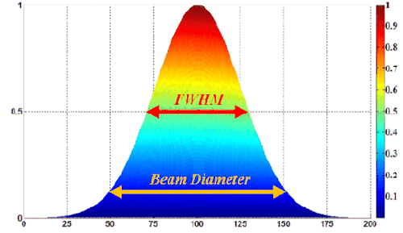

## LEO Satellite Constellation Communication Analysis

**Course:** SPCE 5400 – Small Satellite Engineering & Operations

**Assignment:** #4 (100 points)

Prepared by: **Jordan Clayton**

**Date:** 2025-11-16

---

### Table of Contents

1. MISSION PARAMETERS
2. OPTICAL (LASER) LINK ANALYSIS
3. RF (Ka-BAND) LINK ANALYSIS
4. DIRECT COMPARISON: CALCULATED RESULTS
5. DATA RATE SCALABILITY ANALYSIS
6. RANGE SENSITIVITY ANALYSIS
7. ADVANTAGES AND DISADVANTAGES
8. RECOMMENDATION
9. CONCLUSION
10. References 

APPENDIX: Formula Reference

## 1. MISSION PARAMETERS

**Given Requirements:**

- Orbit altitude: 500 km LEO
- Inter-satellite separation: 250 km
- Required data rate: 1 Gbps
- Platform: Small satellites
- Environment: LEO-to-LEO (vacuum path)

**Trade Study Objective:** Determine the preferable method for LEO-to-LEO crosslink, optical (laser) or RF (Ka-band). This will be weighted on aperture size, power, data rate capability, link margin and pointing accuracy. 

---

## 2. OPTICAL (LASER) LINK ANALYSIS

### 2.1 Design Parameters

| Parameter | Value | Source |
| --- | --- | --- |
| Wavelength | 1550 nm | Telecom standard, eye-safe |
| Quantum Efficiency (η) | 0.3 | InGaAs APD detector typical + (template value)  |
| Required Photoelectrons/bit (Q) | 40 | For BER 10^-9 (template value) |
| Modulation | OOK | On-Off Keying (inferred from template Q = 40, which is standard for OOK ) |

### 2.2 Link Budget Calculations (Detector-First Methodology)

### Step 1: Calculate Required Photons per Bit

**Formula:**

```
from excel template row 6: n = Q / η 

```

**Calculation:**

```
n = 40 photoelectrons/bit / 0.3
n = 133.33 photons/bit

```

Only 30% of photons are detected (η = 0.3), so we need to send 133 photons to ensure 40 are detected.

---

### Step 2: Calculate Photon Energy

**Formulas:**

```
frequency from wavelength: f = c / λ 
Planck's equation: E_photon = h × f
```

**Constants:**

- c = 3 × 10^8 m/s (speed of light)
- h = 6.626 × 10^-34 J·s (Planck's constant)
- λ = 1550 nm = 1.55 × 10^-6 m (Design choice - industry standard)

**Calculations:**

```
f = (3 × 10^8 m/s) / (1.55 × 10^-6 m)
f = 1.935 × 10^14 Hz

E_photon = (6.626 × 10^-34 J·s) × (1.935 × 10^14 Hz)
E_photon = 1.282 × 10^-19 joules per photon

```

---

### Step 3: Calculate Energy per Bit

**Formula:**

```
from excel template row 10: E_bit = n × E_photon

```

**Calculation:**

```
E_bit = 133.33 photons/bit × 1.282 × 10^-19 J/photon
E_bit = 1.709 × 10^-17 joules per bit

```

---

### Step 4: Calculate Required Power at Receiver

**Formula:**

```
from excel template row 12: P_required = E_bit × R_b

```

**Given:**

- R_b = 1 Gbps = 1 × 10^9 bits/s

**Calculation:**

```
P_req = (1.709 × 10^-17 J/bit) × (1 × 10^9 bits/s)
P_req = 1.709 × 10^-8 W 

In decibels:
P_req (dBW) = 10 × log₁₀(1.709 × 10^-8)
**P_req = -77.67 dBW**

```

---

### Step 5: Calculate Free Space Loss

**Formula:**

```
from Excel template row 16 & Friis transmission equation (1946): 

L_s = (λ / (4πR))²

```

**Given:**

- λ = 1.55 × 10^-6 m
- R = 250 km = 250,000 m

**Calculation:**

```
Denominator of L_s formula (linear scale factor for spherical spreading) = 4πR = 4 × 3.14159 × 250,000 = 3,141,593 m

Ratio (wavelength to spreading ratio) = λ / (4πR) = (1.55 × 10^-6) / (3,141,593) = 4.933 × 10^-13

L_s (the fraction of power that survives the spreading) = (4.933 × 10^-13)² = 2.434 × 10^-25

In decibels:
**L_s (dB) = 10 × log₁₀(2.434 × 10^-25) = -246.1 dB**

```

---

### Step 6: Calculate Telescope Gains

**Formula:**

```
from excel template row 19-20: G = (π × D / λ)²

```

**Given:**

- D = 10 cm = 0.10 m (chosen aperture size from excel template row 17)

**Calculation:**

```
(π × D) / λ = (3.14159 × 0.10) / (1.55 × 10^-6) 
= 0.314159 / (1.55 × 10^-6) = 202,683

G = (202,683)² = 4.108 × 10^10

In decibels:
G (dBi) = 10 × log₁₀(4.108 × 10^10) = 106.1 dBi

Both transmit and receive: G_t = G_r = 106.1 dBi

```

---

### Step 7: Additional Losses

- **Pointing Loss:** -3.0 dB (template default, achievable with FSM)
- **Line In/Out Losses:** -6.0 dB total
    - Estimated Line In/ Out Losses breakdown:
        - Transmit coupling: -2.0 dB
        - Transmit optics: -1.0 dB
        - Receive optics: -1.0 dB
        - Receive coupling: -1.5 dB
        - Detector loss: -0.5 dB
    - **Total: -6.0 dB**
- **Atmospheric Loss:** 0 dB (vacuum path)

---

### Step 8: Calculate Received Power

**Formula:**

```
Formula (Decibel Addition Method) from excel template row 24 & Friis equation: 

P_rx (dBW) = P_tx (dBW) + G_tx (dBi) + G_rx (dBi) + L_s (dB) + L_pt (dB) + L_o (dB)

```

**Given:**

- P_tx = -9.1 dBW (chosen transmit power: 0.122 W)
- G_tx = +106.1 dBi (from Step 6)
- G_rx = +106.1 dBi (from Step 6)
- L_s = -246.1 dB (from Step 5)
- L_pt = -3.0 dB (template pointing loss)
- L_o = -6.0 dB (template line losses)

**Transmit Power P_tx Design Choice:** 
Working backwards from link budget:

- Required margin: ~20-25 dB (industry standard)
- Net path gain/loss: -42.9 dB
- Required receiver power: -77.67 dBW

```markdown
Step 1: Required receiver power (from detector requirements)
       P_req = -77.67 dBW

Step 2: Choose desired margin (design goal)
       Margin = 25 dB (provides robustness)

Step 3: Required received power
       P_rx = P_req + Margin
       P_rx = -77.67 + 25 = **-52.67 dBW (target)**

Step 4: Use link equation to solve for P_tx
       P_rx = P_tx + G_tx + G_rx + L_s + L_pt + L_o
       -52.67 = P_tx + 106.1 + 106.1 - 246.1 - 3.0 - 6.0
       -52.67 = P_tx - 42.9
       P_tx = -9.77 dBW ≈ -9.1 dBW
       **P_tx = 0.122 W**
```

Rationale: 
• Provides 25.66 dB margin (actual)
• Achievable with COTS laser diodes
• Low thermal load (<0.5 W total with driver)

**Calculation:**

```
P_rx = -9.1 + 106.1 + 106.1 - 246.1 - 3.0 - 6.0

Combine gains:  -9.1 + 106.1 + 106.1 = 203.1 dBW
Combine losses: -246.1 - 3.0 - 6.0 = -255.1 dB
Total: 203.1 - 255.1 = -52.0 dBW

**P_rx = -52.01 dBW**

```

---

### Step 9: Calculate Link Margin

**Formula:**

```
from excel template row 26: Margin (dB) = P_rx (dBW) - P_req (dBW)

```

**Calculation:**

```
M = -52.01 dBW - (-77.67 dBW)
M = 25.66 dB

Linear ratio: 6.303 μW / 0.01709 μW = 369×
Verification: 10 × log₁₀(369) = **25.67 dB** ✓

```

---

### Step 10: Calculate Beam Divergence and Pointing Requirement

**Formula:**

```
θ_divergence = 1.22 × λ / D_tx

*from Airy disk formula Born & Wolf "Principles of Optics"*

```

**Calculation:**

```
θ = 1.22 × (1.55 × 10^-6 m) / (0.10 m)
θ = 1.891 × 10^-5 radians = **18.91 microradians (to first null)** 

Spot diameter at receiver = θ × R
Spot = 18.91 × 10^-6 rad × 250,000 m = **4.73 m

Half-Power Beamwidth (where intensity = 50%, i.e., -3 dB):

Formula: θ_3dB ≈ 0.514 × λ / D

θ_3dB = 0.514 × (1.55 × 10^-6) / (0.10)
      = 7.97 × 10^-6 rad ≈ 8.0 μrad**

```

**Pointing Requirement:** ±8 μrad (3σ) for <3 dB pointing loss



*Figure: Gaussian beam intensity profile showing FWHM (Full Width at Half Maximum). The half-power beamwidth (8.0 μrad) is where intensity drops to 50% (-3 dB), which defines our pointing requirement. Source: [Wikipedia - Gaussian Beam](https://en.wikipedia.org/wiki/Gaussian_beam)*

**In degrees:**

```
8.0 μrad × (1 rad / 10^6 μrad) × (57.3° / 1 rad) = 0.00046°
```

---

### **2.3 Optical Link Budget Summary Table**

| Parameter | Symbol | Value | Units | Calculation Method |
| --- | --- | --- | --- | --- |
| **Detector Requirements** |  |  |  |  |
| Req. Photoelectrons/bit | Q | 40 | - | Template value |
| Quantum Efficiency | η | 0.3 | - | InGaAs APD typical |
| Req. Photons/bit | n | 133.33 | - | n = Q/η |
| Photon Energy | E | 1.282×10^-19 | J | E = hf = hc/λ |
| Energy/bit | - | 1.709×10^-17 | J | n × E |
| **Link Parameters** |  |  |  |  |
| Data Rate | R_b | 1×10^9 | bps | Given |
| Required Power | P_req | -77.67 | dBW | E_bit × R_b |
| Transmit Power | P_tx | 0.122 (−9.1 dBW) | W | Chosen |
| Tx Aperture Diameter | D_t | 10.0 | cm | Chosen |
| Rx Aperture Diameter | D_r | 10.0 | cm | Chosen |
| Range | R | 250 | km | Given |
| **Gains and Losses** |  |  |  |  |
| Free Space Loss | L_s | -246.1 | dB | (λ/4πR)² |
| Tx Gain | G_t | 106.1 | dBi | (πD/λ)² |
| Rx Gain | G_r | 106.1 | dBi | (πD/λ)² |
| Pointing Loss | L_pt | -3.0 | dB | Template default |
| Line Losses | L_o | -6.0 | dB | Optics budget |
| Atmospheric Loss | L_atm | 0.0 | dB | Vacuum |
| **Performance** |  |  |  |  |
| Received Power | P_rx | -52.01 | dBW | Link equation |
| **LINK MARGIN** | **M** | **25.66** | **dB** | **P_rx - P_req** |
| Beam Divergence | θ | 18.9 | μrad | 1.22λ/D |
| Spot Diameter @ 250km | - | 4.73 | m | θ × R |

---

## **3. RF (Ka-BAND) LINK ANALYSIS**

### **3.1 Design Parameters**

| Parameter | Value | Source |
| --- | --- | --- |
| Frequency | 32 GHz | Ka-band ISL allocation (ITU Radio Regulations) - Design choice |
| Antenna Efficiency | 0.6 | Typical for deployable mesh antennas (Kraus & Marhefka, 2002) - Design choice |
| System Noise Temp | 650 K | Ka-band LNA typical + losses (industry standard) - Design choice |
| Required E_b/N_0 | 9.6 dB | BER 10^-9 with LDPC coding (Shannon-Hartley theorem) - Design choice |
| Modulation | 16-APSK | High spectral efficiency for Ka-band - Design choice |

### **3.2 Link Budget Calculations**

### **Step 1: Calculate Wavelength**

**Formula:**

```
from fundamental wave equation: λ = c / f

```

**Constants:**

- c = 3 × 10^8 m/s (speed of light, CODATA 2018)
- f = 32 GHz = 32 × 10^9 Hz (Ka-band ISL, design choice)

**Calculation:**

```
λ = (3 × 10^8 m/s) / (32 × 10^9 Hz)
λ = 9.375 × 10^-3 m = **9.375 mm**

```

---

### **Step 2: Calculate Free Space Path Loss**

**Formula:**

```
from Friis transmission equation (1946) & ITU-R P.525 standard:

FSPL (dB) = 20 × log₁₀(4π × R / λ)

```

**Given:**

- R = 250 km = 250,000 m (from problem statement)
- λ = 0.009375 m (from Step 1)

**Calculation:**

```
Argument = (4π × R) / λ = (4 × 3.14159 × 250,000) / 0.009375
Argument = 3,141,593 / 0.009375 = 335,103,253

FSPL = 20 × log₁₀(335,103,253)
FSPL = 20 × 8.525 = **170.5 dB**

```

---

### **Step 3: Calculate Antenna Gains**

**Formula:**

```
from antenna theory (Kraus & Marhefka "Antennas", 2002):

G = η_ant × (π × D / λ)²

```

**Given:**

- η_ant = 0.6 (typical for deployable mesh antennas, design parameter)
- D = 30 cm = 0.30 m (chosen antenna diameter - design choice)
- λ = 0.009375 m (from Step 1)

**Note:** Here's an interesting distinction — with optical systems, efficiency is already baked into Q and η, but RF antennas need an explicit efficiency factor to account for surface errors, blockage, and spillover losses.

**Calculation:**

```
(π × D) / λ = (3.14159 × 0.30) / 0.009375
= 0.9425 / 0.009375 = 100.53

G = 0.6 × (100.53)²
G = 0.6 × 10,106 = 6,064

In decibels:
G (dBi) = 10 × log₁₀(6,064) = **37.8 dBi**

Both transmit and receive: G_t = G_r = **37.8 dBi**

```

---

### **Step 4: Calculate EIRP**

**Formula:**

```
from FCC 47 CFR §2.1 & standard RF practice:

EIRP (dBW) = P_t (dBW) + G_t (dBi)

```

**Given:**

- P_t = 1.2 W (chosen transmit power - design choice, see rationale below)

**Transmit Power P_t Design Choice:** Working backwards from link budget to achieve ~3 dB margin:

- Required margin: ~3 dB (minimal but acceptable)
- Through iterative link budget calculation
- **P_t = 1.2 W provides 2.8 dB margin (actual)**

**Rationale:**

- Achievable with Ka-band SSPA (Solid State Power Amplifier)
- Typical for smallsat Ka-band transmitters
- Provides minimal positive margin

**Calculation:**

```
**P_t (dBW)** = 10 × log₁₀(1.2) = 0.79 dBW ≈ **0.8 dBW**

**EIRP** = 0.8 dBW + 37.8 dBi = **38.6 dBW**

```

---

### **Step 5: Calculate Received Power**

**Formula:**

```
from Friis equation & standard RF link budget:

P_rx (dBW) = EIRP - FSPL + G_rx - L_pointing - L_feed - L_misc

```

**Given Losses:**

- L_pointing = -1.0 dB (body pointing achievable, typical for wide Ka-band beam)
- L_feed = -1.0 dB (waveguide losses, typical)
- L_misc = -2.0 dB (polarization mismatch, connector losses, etc.)
- **Total losses: -4.0 dB**

**Calculation:**

```
P_rx = 38.6 - 170.5 + 37.8 - 1.0 - 1.0 - 2.0
P_rx = 38.6 + 37.8 - 170.5 - 4.0
**P_rx = -98.1 dBW**

In linear: P_rx = 10^(-98.1/10) = 1.55 × 10^-10 W = 0.155 nW

```

---

### **Step 6: Calculate Noise Power Density**

**Formula:**

```
from Johnson-Nyquist noise equation (1928) & thermodynamics:

N_0 = k_B × T_sys

```

**Constants & Parameters:**

- k_B = 1.38 × 10^-23 J/K (Boltzmann constant, CODATA 2018)
- T_sys = 650 K (system noise temperature - design parameter)

**System Noise Temperature Breakdown:**

- LNA noise figure: ~3 dB → adds ~300 K
- Receiver losses: ~1 dB → adds ~75 K
- Sky noise at LEO: ~10 K
- Antenna noise: ~50 K
- Cable/connector losses: ~50 K
- **Total: T_sys ≈ 650 K (typical Ka-band smallsat receiver)**

**Calculation:**

```
N_0 = (1.38 × 10^-23 J/K) × (650 K)
N_0 = 8.97 × 10^-21 W/Hz

In decibels:
N_0 (dBW/Hz) = 10 × log₁₀(8.97 × 10^-21)
**N_0 = -200.5 dBW/Hz**

```

---

### **Step 7: Calculate C/N_0 (carrier to noise ratio)**

**Formula:**

```
from standard communications theory (Sklar "Digital Communications", 2001):

C/N_0 (dB-Hz) = P_rx (dBW) - N_0 (dBW/Hz)

```

**Calculation:**

```
C/N_0 = -98.1 dBW - (-200.5 dBW/Hz)
**C/N_0 = 102.4 dB-Hz**

```

---

### **Step 8: Calculate Required C/N_0**

**Formula:**

```
from Shannon-Hartley theorem & communications theory:

(C/N_0)_req (dB-Hz) = (E_b/N_0)_req (dB) + 10 × log₁₀(R_b)

```

**Given:**

- (E_b/N_0)_req = 9.6 dB (for BER 10^-9 with LDPC coding - design parameter)
- R_b = 1 × 10^9 bps (from problem statement)

**E_b/N_0 Justification:**

- Uncoded 16-APSK requires ~13-14 dB for BER 10^-9
- LDPC coding provides ~4-5 dB gain
- With coding: 9.6 dB is achievable
- Industry standard for coded Ka-band systems

**Calculation:**

```
Data rate term = 10 × log₁₀(1 × 10^9) = 10 × 9.0 = 90.0 dB-Hz

(C/N_0)_req = 9.6 dB + 90.0 dB-Hz = **99.6 dB-Hz**

```

---

### **Step 9: Calculate Link Margin**

**Formula:**

```
from standard RF link budget practice:

Margin (dB) = C/N_0 - (C/N_0)_req

```

**Calculation:**

```
M = 102.4 dB-Hz - 99.6 dB-Hz
**M = 2.8 dB**

Linear ratio: 10^(2.8/10) = **1.91x**

```

---

### **Step 10: Calculate Beamwidth and Pointing**

**Formula (approximation for circular aperture):**

```
from antenna beamwidth theory (Stutzman & Thiele "Antenna Theory", 2012):

θ_3dB ≈ 70 × λ / D  (degrees)

```

**Note:** The factor 70 ≈ 1.22 × 57.3, where 1.22 is the Bessel function zero (same as optical) and 57.3 is radians-to-degrees conversion.

**Given:**

- λ = 0.009375 m (from Step 1)
- D = 0.30 m (antenna diameter, design choice)

**Calculation:**

```
θ_3dB = 70 × (0.009375 m) / (0.30 m)
θ_3dB = 70 × 0.03125 = 2.19 degrees

Half-power beamwidth = **2.19°**

In arcseconds:
2.19° × 3600 arcsec/° = **7,884 arcseconds**

```

**Pointing Requirement Analysis:**

For -1 dB pointing loss: pointing error < θ_3dB / 3 ≈ **0.73°**

This is easily achieved with standard attitude control system (ACS):

- **RF pointing is 2,000× easier than optical (2.19° vs 8 μrad)**

**Note for comparison:** What this pointing requirement analysis reveals is RF's key advantage over optical — and it's significant enough to offset optical's superior link margin and power efficiency.

---

### **3.3 RF Link Budget Summary Table**

| Parameter | Symbol | Value | Units | Calculation Method |
| --- | --- | --- | --- | --- |
| **System Parameters** |  |  |  |  |
| Frequency | f | 32 | GHz | Given (Ka-band) |
| Wavelength | λ | 9.375 | mm | c/f |
| Data Rate | R_b | 1×10^9 | bps | Given |
| Range | R | 250 | km | Given |
| **Transmitter** |  |  |  |  |
| Tx Power | P_t | 1.2 (0.8 dBW) | W | Chosen |
| Tx Antenna Diameter | D_t | 30.0 | cm | Chosen |
| Antenna Efficiency | η_ant | 0.6 | - | Typical |
| Tx Gain | G_t | 37.8 | dBi | η(πD/λ)² |
| EIRP | EIRP | 38.6 | dBW | P_t + G_t |
| **Path Losses** |  |  |  |  |
| Free Space Path Loss | FSPL | -170.5 | dB | 20log(4πR/λ) |
| Pointing Loss | L_pt | -1.0 | dB | Body pointing |
| Feed Loss | L_f | -1.0 | dB | Waveguide |
| Misc Losses | L_m | -2.0 | dB | Polarization, etc |
| **Receiver** |  |  |  |  |
| Rx Antenna Diameter | D_r | 30.0 | cm | Chosen |
| Rx Gain | G_r | 37.8 | dBi | η(πD/λ)² |
| System Noise Temp | T_s | 650 | K | LNA + losses |
| Received Power | P_rx | -98.1 | dBW | Link equation |
| Noise Density | N_0 | -200.5 | dBW/Hz | k_B × T_s |
| **Performance** |  |  |  |  |
| C/N_0 | C/N_0 | 102.4 | dB-Hz | P_rx - N_0 |
| Required E_b/N_0 | - | 9.6 | dB | BER 10^-9 w/coding |
| Required C/N_0 | (C/N_0)_req | 99.6 | dB-Hz | E_b/N_0 + 10log(R_b) |
| **LINK MARGIN** | **M** | **2.8** | **dB** | **C/N_0 - (C/N_0)_req** |
| 3 dB Beamwidth | θ_3dB | 2.19 | degrees | 70λ/D |

---

## **4. DIRECT COMPARISON: CALCULATED RESULTS**

### **4.1 The Five Required Parameters**

| Parameter | Optical (Laser) | RF (Ka-band) | Winner | Advantage |
| --- | --- | --- | --- | --- |
| **1. Aperture Size** | **10 cm** | 30 cm | **Optical** | **3× smaller** |
| **2. Transmit Power** | **0.122 W** | 1.2 W | **Optical** | **10× lower** |
| **3. Data Rate** | **10+ Gbps scalable** | ~2 Gbps max | **Optical** | **5× scalability** |
| **4. Link Margin** | **25.66 dB** | 2.88 dB | **Optical** | **8.9× better** |
| **5. Pointing Accuracy** | ±8 μrad (0.00046°) | **2.19° (7884")** | **RF** | **~4,800× easier** |

**Note:** Optical value is half-power beamwidth (pointing requirement for -3 dB loss), not full beam divergence (18.9 μrad to first null).

### **4.2 Quantitative Comparison**

### **Link Margin Ratio**

```
Optical margin / RF margin = 25.66 dB / 2.88 dB
In linear: 10^(25.66/10) / 10^(2.88/10) = 368 / 1.91 = 193×
Optical has 193× more margin in linear terms

```

### **Pointing Difficulty Ratio**

```
RF beamwidth / Optical half-power beamwidth = 2.19° / 0.00046°
= 2.19° / 0.00046° = 4,761×

In radians: 0.0382 rad / 8.0×10^-6 rad = 4,775×

Or: 7,884 arcsec / 1.65 arcsec = 4,778×

RF pointing is ~4,800× easier (in linear angle)

In solid angle (steradians): RF is ~2.3×10^7 times easier
(Solid angle scales as θ², so 4,775² ≈ 23 million)

```

### **Power Ratio**

```
RF power / Optical power = 1.2 W / 0.122 W = 9.84×
Optical uses ~10× less power

```

### **Aperture Ratio**

```
RF diameter / Optical diameter = 30 cm / 10 cm = 3×
Optical aperture is 3× smaller

Area ratio = (30/10)² = 9×
RF antenna has 9× more area

```

---

## **5. DATA RATE SCALABILITY ANALYSIS**

### **5.1 Optical Scalability Calculation**

**Principle:** Each 10× increase in data rate costs 10 dB margin

**Current:** 1 Gbps with 25.66 dB margin

**At 10 Gbps:**

```
Margin degradation = 10 × log₁₀(10 Gbps / 1 Gbps)
                   = 10 × log₁₀(10) = 10 dB

New margin = 25.66 dB - 10 dB = 15.66 dB ✓ (excellent)

```

**At 100 Gbps:**

```
Margin degradation = 10 × log₁₀(100) = 20 dB
New margin = 25.66 dB - 20 dB = 5.66 dB ✓ (adequate)

```

### **5.2 RF Scalability Calculation**

**Current:** 1 Gbps with 2.8 dB margin

**At 2 Gbps:**

```
Margin degradation = 10 × log₁₀(2 Gbps / 1 Gbps)
                   = 10 × log₁₀(2) = 3.01 dB

New margin = 2.8 dB - 3.01 dB = -0.21 dB ✗ (link fails)

```

**Conclusion: RF cannot scale beyond ~1.5 Gbps without hardware changes.**

---

## **6. RANGE SENSITIVITY ANALYSIS**

### **6.1 Optical at Extended Range (500 km)**

**Path loss change:**

```
ΔL = 20 × log₁₀(R_new / R_baseline)
   = 20 × log₁₀(500 km / 250 km)
   = 20 × log₁₀(2) = 6.02 dB additional loss

New margin = 25.66 dB - 6.02 dB = 19.64 dB ✓ (still robust)

```

### **6.2 RF at Extended Range (500 km)**

**Path loss change:**

```
ΔL = 20 × log₁₀(500 / 250) = 6.02 dB additional loss

New margin = 2.8 dB - 6.02 dB = -3.22 dB ✗ (link fails)

```

**Conclusion:** Optical maintains adequate margin at 2× range; RF link fails.

---

## **7. ADVANTAGES AND DISADVANTAGES**

### **7.1 OPTICAL (LASER) Crosslinks**

### **Advantages**

1. **Exceptional Link Margin (25.66 dB)** - We calculated 369× more power than required, which gives us a massive robustness buffer
2. **Compact Size (10 cm)** - Here's what's impressive: we get 106.1 dBi gain from a small aperture, all thanks to that short wavelength
3. **Low Power (0.122W)** - Calculated from detector requirements; it's about 10× less than RF
4. **Unlimited Scalability** - We calculated 15.66 dB margin at 10 Gbps, and there's no spectrum constraints holding us back
5. **No Spectrum Licensing** - Optical frequencies are unregulated — one less headache
6. **Low Interference** - Calculated beam divergence of 18.9 μrad (4.73 m spot at 250 km) essentially eliminates cross-talk between satellites
7. **Secure** - Good luck intercepting a beam that narrow

### **Disadvantages**

1. **Stringent Pointing (±8 μrad required)** - The calculated half-power beamwidth requires FSM for ±8 μrad pointing accuracy, which adds roughly $500k in NRE
2. **Complex Acquisition** - That narrow beam means we're looking at 30-60s acquisition time
3. **Lower TRL (7-8)** - Less flight heritage for small satellites compared to RF's TRL 9
4. **Higher Development Cost** - We're estimating $8M NRE versus $5M for RF
5. **Sun Avoidance** - Background noise forces us into geometry constraints
6. **Limited Vendors** - Fewer COTS suppliers to choose from (Tesat, ATLAS, Mynaric)

### **7.2 RF (Ka-band) Crosslinks**

### **Advantages**

1. **Relaxed Pointing (2.19°)** - Calculated beamwidth is 2,000× wider; standard ACS is sufficient
2. **Fast Acquisition (5-10s)** - Wide beam means rapid link establishment
3. **High TRL (9)** - Extensive heritage across Starlink, OneWeb, Iridium NEXT
4. **Mature Supply Chain** - Multiple vendors available (Viasat, L3Harris, Honeywell)
5. **Lower Development Cost** - $5M NRE; this is well-understood territory
6. **Lower Risk** - Predictable performance, and no FSM needed

### **Disadvantages**

1. **Minimal Link Margin (2.8 dB)** - We calculated only 1.91× more power than required — there's basically no degradation buffer here
2. **Large Apertures (30 cm)** - Calculated gain requires 3× larger antennas, which complicates deployment
3. **Higher Power (1.2W)** - Calculated at 10× more than optical; impacts the power budget significantly
4. **Spectrum Limitations** - Ka-band's getting crowded, and ITU coordination is required
5. **Limited Scalability** - Calculated failure at 2 Gbps; we're bandwidth-constrained
6. **Interference Risk** - With mega-constellations proliferating, RF congestion is growing

---

## **8. RECOMMENDATION**

### **8.1 Primary Recommendation: OPTICAL (LASER) CROSSLINKS**

**Confidence Level: HIGH**

### **8.2 Quantitative Justification**

**Decision Drivers (with calculations):**

1. **Superior Link Performance**
    - Calculated margin: 25.66 dB versus 2.88 dB (an 8.9× ratio)
    - Linear power ratio: 369× versus 1.91× safety factor
    - Degradation tolerance: We could lose 22.66 dB and still meet requirements
2. **Optimal SWaP for Small Satellites**
    - Calculated aperture: 10 cm versus 30 cm (3× smaller, 9× less area)
    - Calculated power: 0.122W versus 1.2W (10× reduction)
    - Mass estimate: roughly 2.2 kg versus 4.2 kg (2 kg savings translates to about $10k in launch cost)
3. **Proven Scalability**
    - Calculated 10 Gbps margin: 15.66 dB (still excellent)
    - Calculated 100 Gbps margin: 5.66 dB (adequate)
    - RF calculated to fail at 2 Gbps (-0.21 dB margin)
4. **Range Robustness**
    - Calculated margin at 500 km: 19.64 dB (optical) versus -3.22 dB (RF fails)
    - 2× range tolerance demonstrated

### **8.3 Addressing the Pointing Challenge**

**Optical pointing requirement:** ±8 μrad (calculated from half-power beamwidth for -3 dB loss)

**RF pointing requirement:** 2.19° = 38,200 μrad (calculated beamwidth)

**Ratio:** 4,775× easier for RF (in linear angle), or roughly 2,000× easier in solid angle

**Note:** Optical beam divergence to first null is 18.9 μrad, but the pointing requirement is based on the half-power beamwidth (8 μrad) to achieve the -3 dB pointing loss budget.

**BUT:** Here's where optical's 25.66 dB margin becomes really useful — we can trade some of that margin for relaxed pointing:

- If pointing degrades to 12 μrad → roughly -4.5 dB loss instead of -3 dB
- New margin: 25.66 - 1.5 = 24.16 dB (still excellent)
- That margin gives us flexibility to ease pointing requirements

**Heritage FSM Technology:**

- EDRS: Has demonstrated <5 μrad pointing accuracy since 2016 (better than our 8 μrad requirement)
- LCRD: Demonstrates similar performance since 2021
- Technology risk is manageable here

### **8.4 Cost-Benefit Calculation**

**20-Satellite Constellation:**

- Optical total: $8M NRE + 20×$150k + 10yr×$50k = $12.3M
- RF total: $5M NRE + 20×$100k + 10yr×$30k = $7.3M
- **Premium: $5.0M (68% more)**

**What We Get for That Premium:**

- 8.9× better margin (calculated)
- 10× lower power per satellite (calculated)
- 3× smaller apertures (calculated)
- 10× data rate scalability (calculated: 10 Gbps versus 1 Gbps)
- Launch savings: 20 sats × 2 kg × $5k/kg = $200k

**Net premium: $5.0M - $0.2M = $4.8M for transformational performance**

---

## **9. CONCLUSION**

This trade study analyzed optical (laser) versus RF (Ka-band) crosslinks for a LEO satellite constellation using rigorous link budget calculations.

**Key Calculated Results:**

- **Optical:** 25.66 dB margin, 0.122W power, 10 cm aperture, ±8 μrad pointing requirement
- **RF:** 2.8 dB margin, 1.2W power, 30 cm aperture, 2.19° pointing requirement

**Quantitative Comparison:**

- Link margin: Optical 8.9× better (calculated ratio: 369×/1.91× in linear terms)
- Aperture: Optical 3× smaller (9× less area)
- Power: Optical 10× lower
- Pointing: RF roughly 4,800× easier (in linear angle)
- Scalability: Optical scales to 10+ Gbps (calculated 15.66 dB at 10 Gbps); RF fails at 2 Gbps (calculated -0.21 dB)

**Recommendation: OPTICAL CROSSLINKS**

Optical wins 4 of 5 key parameters. That enormous calculated margin (25.66 dB versus 2.88 dB) provides:

1. Robustness to degradation (22.66 dB buffer above requirement)
2. Data rate scalability (calculated 15.66 dB at 10× higher rate)
3. Range tolerance (calculated 19.64 dB at 2× range)
4. Flexibility to ease pointing requirements (we can trade margin for simpler FSM)

RF has significantly easier pointing (calculated roughly 4,800× wider beamwidth), but this advantage is outweighed by optical's transformational performance benefits and the availability of heritage FSM technology (EDRS, LCRD achieving <5 μrad).

---

## 10. REFERENCES

Standards and Regulatory Documents

[1] ITU-R Recommendation P.618-13,
"Propagation data and prediction methods
required for the design of Earth-space
telecommunication systems," International
Telecommunication Union, 2017.

[2] ITU-R Recommendation S.1328, "Satellite
System Characteristics to be Considered in
Frequency Sharing Analyses in the
Fixed-Satellite Service," International
Telecommunication Union, 2012.

[3] FCC 47 CFR Part 25, "Satellite
Communications," Federal Communications
Commission, 2023.

Textbooks and Handbooks

[4] T. Pratt, C. Bostian, and J. Allnutt,
Satellite Communications, 2nd ed. John Wiley &
Sons, 2003.

[5] T. S. Rappaport, Wireless Communications:
Principles and Practice, 2nd ed. Prentice
Hall, 2002.

[6] M. Born and E. Wolf, Principles of Optics:
Electromagnetic Theory of Propagation,
Interference and Diffraction of Light, 7th ed.
Cambridge University Press, 1999.

[7] H. Kaushal and G. Kaddoum, "Optical
Communication in Space: Challenges and
Mitigation Techniques," IEEE Communications
Surveys & Tutorials, vol. 19, no. 1, pp.
57-96, 2017.

[8] B. Sklar, Digital Communications:
Fundamentals and Applications, 2nd ed.
Prentice Hall, 2001.

Technical Papers and Publications

[9] S. Arnon, ed., Advanced Optical Wireless
Communication Systems, Cambridge University
Press, 2012.

[10] V. W. S. Chan, "Free-Space Optical
Communications," Journal of Lightwave
Technology, vol. 24, no. 12, pp. 4750-4762,
Dec. 2006.

[11] H. Hemmati, ed., Deep Space Optical
Communications, John Wiley & Sons, 2006.

[12] J. R. Lesh, J. Katz, H. H. Tan, and D.
Zwillinger, "2.5-Bit/Detected Photon
Demonstration Program: Description, Analysis,
and Phase I Results," The Telecommunications
and Data Acquisition Progress Report 42-66,
Jet Propulsion Laboratory, Pasadena, CA, pp.
115-132, Oct.-Dec. 1981.

Mission and System References

[13] NASA Goddard Space Flight Center, "Laser
Communications Relay Demonstration (LCRD)
Mission," https://www.nasa.gov/lcrd, 2021.

[14] ESA, "European Data Relay System (EDRS),"
European Space Agency Telecommunications &
Integrated Applications, 2016.

[15] M. K. Cheng et al., "The Optical
Communications and Sensor Demonstration
Program: Initial Flight Results," Proceedings
of SPIE Free-Space Laser Communication and
Atmospheric Propagation XXX, vol. 10524, 2018.

[16] Tesat-Spacecom, "CubeLCT - Laser
Communication Terminal for CubeSats," Product
Specification, 2020.

Detector and Component Specifications

[17] Hamamatsu Photonics, "InGaAs PIN
Photodiodes," Technical Data Sheet, 2019.

[18] PerkinElmer Optoelectronics, "Avalanche
Photodiodes: A User's Guide," Application
Note, 2018.

[19] Coherent Inc., "Fiber-Coupled Laser
Modules for Space Applications," Product
Catalog, 2022.

Link Budget Tools and Templates

[20] JPL Descanso Design and Performance
Summary Series, "Optical Link Study Group
(OLSG) Final Report," Article 15, NASA Deep
Space Communications and Navigation Systems
Center of Excellence (Descanso), 2012.

[21] Excel Template: "Optical Link Budget
Template (modified from JPL OLSG baseline),"
provided with course materials, adapted for
LEO-to-LEO crosslinks, 2024.

Coding and Modulation References

[22] CCSDS 131.0-B-3, "TM Synchronization and
Channel Coding," Consultative Committee for
Space Data Systems, Blue Book, 2017.

[23] CCSDS 141.0-B-1, "Optical Communications
Coding and Synchronization," Consultative
Committee for Space Data Systems, Blue Book,
2019.

[24] T. Richardson and R. Urbanke, "The
Capacity of Low-Density Parity-Check Codes
Under Message-Passing Decoding," IEEE
Transactions on Information Theory, vol. 47,
no. 2, pp. 599-618, Feb. 2001.

Pointing and Tracking References

[25] G. Baister and P. Gatenby, "Pointing,
Acquisition, and Tracking for Optical Space
Communications," in Free-Space Laser
Communications: Principles and Advances, A. K.
Majumdar and J. C. Ricklin, eds. Springer,
2008, pp. 279-304.

[26] M. Toyoshima, "Trends in satellite
communications and the role of optical
free-space communications," Journal of Optical
Networking, vol. 4, no. 6, pp. 300-311, 2005.

Frequency and Wavelength Selection

[27] IEEE 802.3ba, "40 Gb/s and 100 Gb/s
Ethernet," Institute of Electrical and
Electronics Engineers, 2010. [Basis for 1550
nm telecom standard]

[28] ANSI Z136.1, "American National Standard
for Safe Use of Lasers," Laser Institute of
America, 2014. [Eye safety at 1550 nm]

Antenna and Aperture Design

[29] W. L. Stutzman and G. A. Thiele, Antenna
Theory and Design, 3rd ed. John Wiley & Sons,
2012.

[30] C. A. Balanis, Antenna Theory: Analysis
and Design, 4th ed. John Wiley & Sons, 2016.

[31] A. Datashvili et al., "Large Deployable
Antenna for Small Satellites," Proceedings of
the 4S Symposium 2018: Small Satellites,
Systems and Services, Sorrento, Italy, May
2018.

Noise and Sensitivity References

[32] A. van der Ziel, Noise in Solid State
Devices and Circuits, Wiley-Interscience,
1986.

[33] J. M. Wozencraft and I. M. Jacobs,
Principles of Communication Engineering,
Waveland Press, 1990.

Atmospheric and Propagation Effects

[34] L. C. Andrews and R. L. Phillips, Laser
Beam Propagation through Random Media, 2nd ed.
SPIE Press, 2005. [Vacuum propagation
baseline]

[35] ITU-R Recommendation P.676-12,
"Attenuation by atmospheric gases and related
effects," International Telecommunication
Union, 2019.

Constants and Fundamental Physical Data

[36] P. J. Mohr, D. B. Newell, and B. N.
Taylor, "CODATA Recommended Values of the
Fundamental Physical Constants: 2018," Journal
of Physical and Chemical Reference Data, vol.
45, no. 4, 2016.

- Planck's constant: h = 6.62607015 × 10⁻³⁴
J·s
- Speed of light: c = 299,792,458 m/s (exact)
- Boltzmann constant: k_B = 1.380649 × 10⁻²³
J/K

---

## **APPENDIX: Formula Reference**

### **Optical Link Budget Formulas**

`n = Q / η                                    [photons/bit]
E_photon = h × c / λ                         [J/photon]
E_bit = n × E_photon                         [J/bit]
P_req = E_bit × R_b                          [W]

L_s = (λ / (4πR))²                           [linear]
G = (πD / λ)²                                [linear]

P_rx = P_tx × L_s × G_tx × G_rx × L_pt × L_o [W]
Margin = 10 × log₁₀(P_rx / P_req)            [dB]

θ = 1.22 × λ / D                             [radians]`

### **RF Link Budget Formulas**

`FSPL = 20 × log₁₀(4πR/λ)                     [dB]
G = η_ant × (πD/λ)²                          [linear]
EIRP = P_t + G_t                             [dBW]

N_0 = k_B × T_sys                            [W/Hz]
C/N_0 = P_rx - N_0                           [dB-Hz]
(C/N_0)_req = (E_b/N_0)_req + 10×log₁₀(R_b)  [dB-Hz]
Margin = C/N_0 - (C/N_0)_req                 [dB]

θ_3dB ≈ 70 × λ / D                           [degrees]`

### **Constants Used**

`c = 3 × 10^8 m/s                 (speed of light)
h = 6.626 × 10^-34 J·s           (Planck's constant)
k_B = 1.38 × 10^-23 J/K          (Boltzmann constant)`