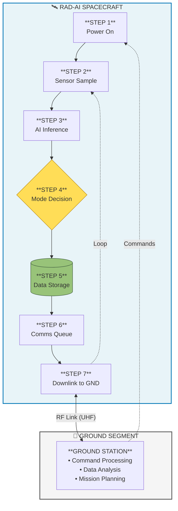
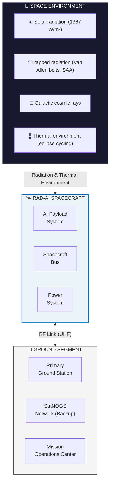
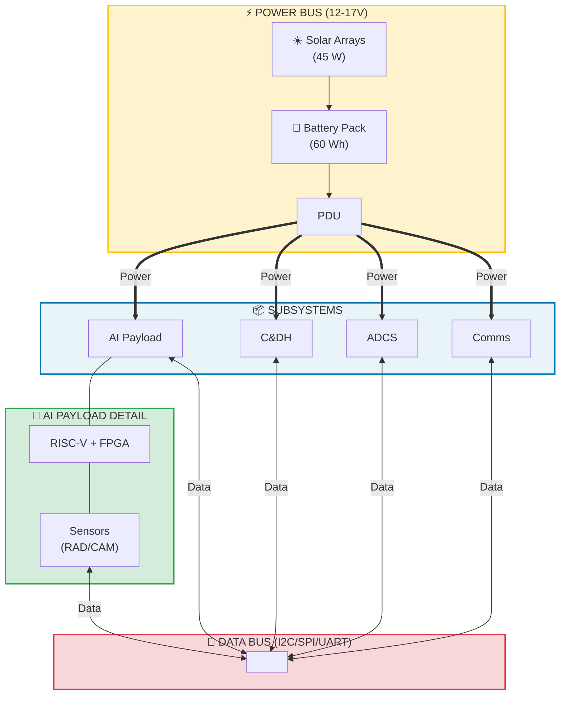
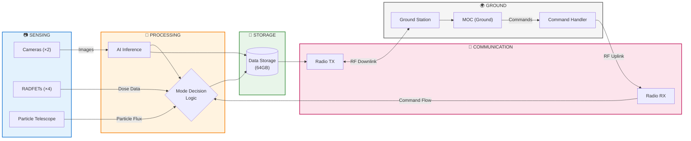
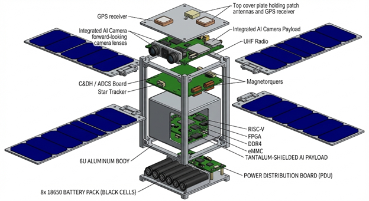
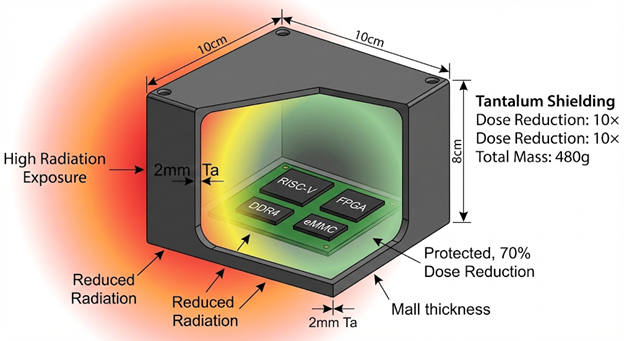
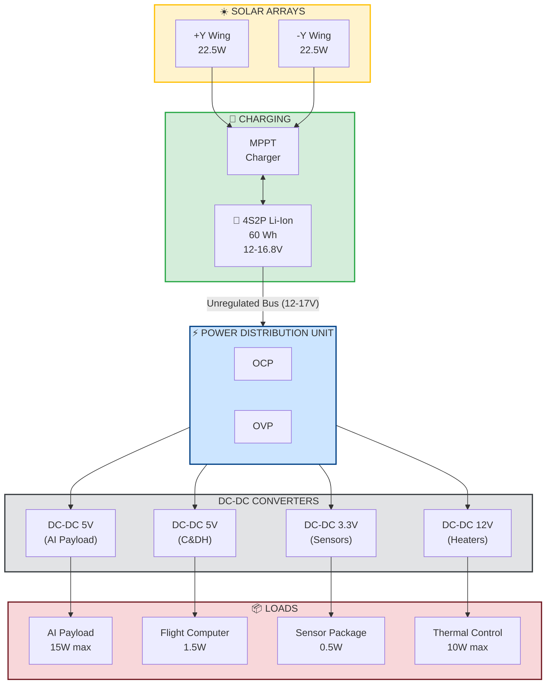
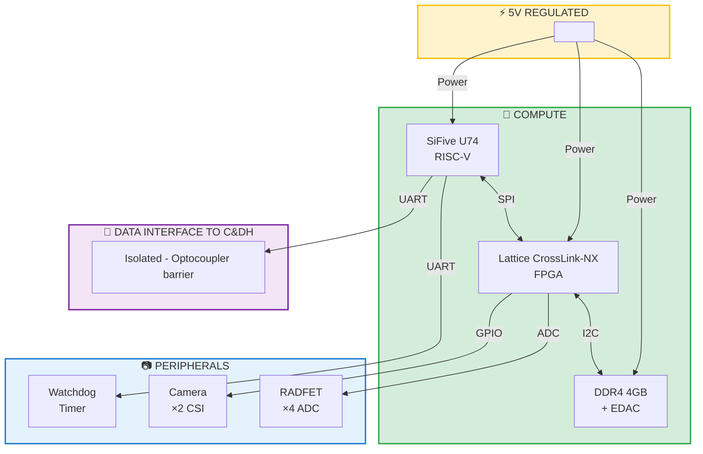
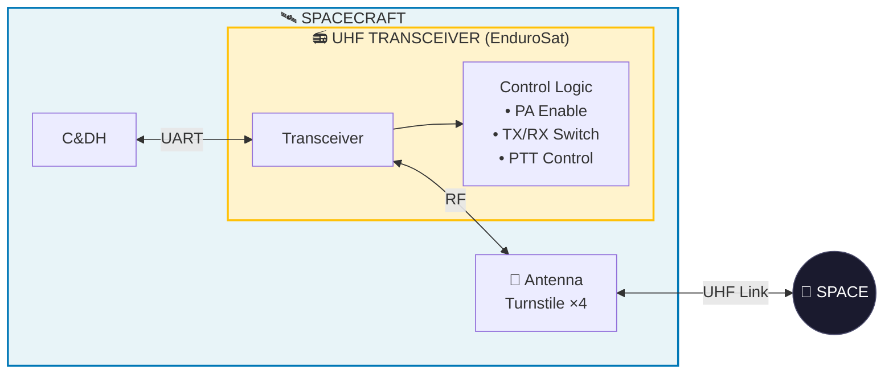

# RAD-AI: Radiation-Mitigated Edge AI for Autonomous Space Operations

**UCCS CubeSat Design Project**

Jordan Clayton

SPCE 5400 – Small Satellite Engineering & Operations

University of Colorado Colorado Springs

December 2025

**Revision 2.0** | December 17, 2025

*Changes from Rev 1.0: Added link budget analysis, CSLI scoring appendix, expanded TMR implementation details, radiation test configuration matrix, FMEA summary table, data management strategy*

---

## Table of Contents

1. [Executive Summary](#1-executive-summary)
2. [Introduction](#2-introduction)
   - 2.1 [Objective](#21-objective)
   - 2.2 [Problem Statement](#22-problem-statement)
3. [Project Planning and Management](#3-project-planning-and-management)
4. [Problem Specifications](#4-problem-specifications)
   - 4.1 [Project Requirements](#41-project-requirements)
     - 4.1.1 [Communications Requirements List](#411-communications-requirements-list)
     - 4.1.2 [Power Requirements List](#412-power-requirements-list)
     - 4.1.3 [Telemetry and Control Requirements List](#413-telemetry-and-control-requirements-list)
     - 4.1.4 [Mechanical Requirements List](#414-mechanical-requirements-list)
     - 4.1.5 [Thermal Requirements List](#415-thermal-requirements-list)
5. [Conceptual Design](#5-conceptual-design)
   - 5.1 [Missions](#51-missions)
   - 5.2 [Electrical](#52-electrical)
   - 5.3 [Structure](#53-structure)
6. [Electrical Testing Methods and Results](#6-electrical-testing-methods-and-results)
7. [Structural Testing Methods and Results](#7-structural-testing-methods-and-results)
8. [Final Design](#8-final-design)
   - 8.1 [Mission](#81-mission)
   - 8.2 [Electrical](#82-electrical)
   - 8.3 [Structure](#83-structure)
9. [Concept of Operations](#9-concept-of-operations)
10. [System Block Definitions Diagram](#10-system-block-definitions-diagram)
11. [Expected Flight Results](#11-expected-flight-results)
12. [Conclusion](#12-conclusion)
13. [Sponsor Interactions](#13-sponsor-interactions)
14. [Team Interactions](#14-team-interactions)
15. [References](#15-references)
16. [Appendices](#16-appendices)
    - Appendix A – 3D CAD Drawings and Spacecraft Configuration
    - Appendix B – Complete System Circuit
    - Appendix C – Requirements and Verification Matrix
    - Appendix D – Management
    - Appendix E – CSLI Selection Probability Analysis

---

## List of Figures

| Figure | Title | Section |
|--------|-------|---------|
| 9.1 | [CONOPS Diagram](#9-concept-of-operations) | §9 |
| 10.1 | [External System Diagram](#101-external-system-diagram) | §10.1 |
| 10.2 | [Internal System Diagram](#102-internal-system-diagram) | §10.2 |
| 10.3 | [Functional Data Flow Diagram](#103-functional-system-diagram) | §10.3 |
| A.1 | [Isometric View – Stowed Configuration](#a1-spacecraft-external-views) | Appendix A |
| A.2 | [Isometric View – Deployed Configuration](#a1-spacecraft-external-views) | Appendix A |
| A.3 | [Exploded View – Internal Layers](#a2-internal-component-layout) | Appendix A |
| A.4 | [AI Payload Shielding Configuration](#a3-shielding-enclosure-detail) | Appendix A |
| A.5 | [Solar Array Deployment Sequence](#a4-deployable-mechanisms) | Appendix A |
| B.1 | [Power Distribution Architecture](#b1-power-system-schematic) | Appendix B |
| B.2 | [AI Payload Block Diagram](#b2-ai-payload-circuit) | Appendix B |
| B.3 | [UHF Communications Block Diagram](#b3-communications-system-circuit) | Appendix B |
| D.1 | [Project Gantt Chart](#d1-detailed-project-schedule) | Appendix D |

---

## List of Tables

| Table | Title | Section |
|-------|-------|---------|
| 3.1 | [Project Budget Summary](#3-project-planning-and-management) | §3 |
| 3.2 | [FMEA Summary - Top 5 Failure Modes](#failure-modes-and-effects-analysis-fmea-summary) | §3 |
| 4.1 | [Communications Requirements](#411-communications-requirements-list) | §4.1.1 |
| 4.2 | [Power Requirements](#412-power-requirements-list) | §4.1.2 |
| 4.3 | [Telemetry and Control Requirements](#413-telemetry-and-control-requirements-list) | §4.1.3 |
| 4.4 | [Mechanical Requirements](#414-mechanical-requirements-list) | §4.1.4 |
| 4.5 | [Thermal Requirements](#415-thermal-requirements-list) | §4.1.5 |
| 5.1 | [Mission Trade Study](#51-missions) | §5.1 |
| 5.2 | [Processor Trade Study](#52-electrical) | §5.2 |
| 5.3 | [FPGA/AI Accelerator Trade Study](#52-electrical) | §5.2 |
| 5.4 | [Shielding Trade Study](#53-structure) | §5.3 |
| 6.1 | [Board Power-On Test Criteria](#61-board-power-on-testing) | §6.1 |
| 6.2 | [Radiation Test Success Criteria](#62-radiation-testing) | §6.2 |
| 6.2a | [Radiation Test Configuration Matrix](#radiation-test-configuration-matrix) | §6.2 |
| 6.3 | [TMR Validation Criteria](#63-tmr-validation-testing) | §6.3 |
| 6.4 | [Power System Test Criteria](#64-power-system-testing) | §6.4 |
| 7.1 | [Mass Properties Requirements](#71-mass-properties-verification) | §7.1 |
| 7.2 | [Dimensional Requirements (CDS Rev. 14)](#72-fit-check-and-dimensional-verification) | §7.2 |
| 7.3 | [Random Vibration Spectrum (NASA GEVS)](#73-vibration-testing) | §7.3 |
| 7.4 | [Thermal Vacuum Test Criteria](#74-thermal-vacuum-testing) | §7.4 |
| 8.1 | [Operational Mode Summary](#81-mission) | §8.1 |
| 8.2 | [AI Payload Specifications](#82-electrical) | §8.2 |
| 8.3 | [Shielding Configuration](#82-electrical) | §8.2 |
| 8.4 | [Sensor Specifications](#82-electrical) | §8.2 |
| 8.5 | [Power Budget](#82-electrical) | §8.2 |
| 8.6 | [Mass Budget](#83-structure) | §8.3 |
| 8.7 | [Predicted Temperature Ranges](#83-structure) | §8.3 |
| 11.1 | [Predicted Radiation Environment](#111-orbital-environment-predictions) | §11.1 |
| 11.2 | [Predicted AI Accuracy Over Mission](#112-ai-performance-predictions) | §11.2 |
| 11.3 | [Predicted SEU Rates](#114-seu-rate-predictions) | §11.4 |
| 11.4 | [Daily Data Generation](#115-data-products) | §11.5 |
| 11.5 | [Success Criteria Assessment](#116-success-criteria-verification) | §11.6 |
| 13.1 | [Sponsor Engagement Status](#13-sponsor-interactions) | §13 |
| 14.1 | [Communication Channels](#14-team-interactions) | §14 |
| C.1 | [Communications Requirements Verification](#c1-communications-requirements-verification) | Appendix C |
| C.2 | [Power Requirements Verification](#c2-power-requirements-verification) | Appendix C |
| C.3 | [Telemetry and Control Requirements Verification](#c3-telemetry-and-control-requirements-verification) | Appendix C |
| C.4 | [Mechanical Requirements Verification](#c4-mechanical-requirements-verification) | Appendix C |
| C.5 | [Thermal Requirements Verification](#c5-thermal-requirements-verification) | Appendix C |
| D.1 | [Detailed Cost Breakdown](#d2-detailed-budget-breakdown) | Appendix D |
| D.2 | [Project Risk Register](#d3-risk-register) | Appendix D |
| D.3 | [Work Breakdown Structure](#d4-work-breakdown-structure) | Appendix D |
| E.1 | [CSLI Evaluation Criteria and RAD-AI Scores](#e1-csli-selection-criteria) | Appendix E |
| E.2 | [Selection Probability Sensitivity](#e3-sensitivity-analysis) | Appendix E |

---

## 1. Executive Summary

RAD-AI is a 6U CubeSat mission designed to validate commercial-off-the-shelf (COTS) artificial intelligence hardware with radiation mitigation techniques in Low Earth Orbit (LEO). The mission addresses a critical capability gap in autonomous space computing: radiation-hardened processors such as the BAE RAD750 lack the computational throughput required for real-time AI inference, while commercial AI accelerators deliver adequate performance but exhibit unacceptable failure rates in the space radiation environment [1, 2].

The primary objective of RAD-AI is to demonstrate AI-driven autonomous computing with radiation-aware operation for a minimum of 12 months in LEO. The payload couples a SiFive U74 RISC-V quad-core processor with an FPGA-based AI accelerator, implementing Triple Modular Redundancy (TMR) in software, selective tantalum shielding, watchdog timers, and Error Detection and Correction (EDAC) memory protection [3, 4]. Unlike previous AI CubeSat demonstrations such as ESA's Phi-Sat-1, which performed static cloud detection, RAD-AI demonstrates real-time radiation event detection and autonomous mode switching—the system detects high-radiation zones including the South Atlantic Anomaly (SAA) and automatically adjusts processing parameters to prevent data corruption [5, 6].

The mission targets the 2025-2027 development window before NASA's High Performance Spaceflight Computing (HPSC) processors become widely available [7]. RAD-AI provides empirical flight data on COTS AI degradation patterns and mitigation effectiveness, informing both LEO constellation designs and HPSC integration strategies for deep-space missions supporting Artemis and Mars Sample Return [8, 9].

The spacecraft utilizes a hybrid development approach combining a COTS 6U bus with a custom AI payload. The 6U form factor (20×10×34 cm, <14 kg) allocates 1.5U for the AI payload, 1.5U for power systems, and 3U for the spacecraft bus [10]. Power requirements average approximately 36 W with AI processing peaks of 15-30 W, supplied by GaAs solar arrays generating 45 W at beginning of life and a 60 Wh lithium-ion battery [11].

Total development cost is estimated at $100,000-$120,000, with launch services provided through NASA's CubeSat Launch Initiative (CSLI) valued at approximately $250,000 [12]. The project timeline spans three years: design and development (months 1-24), integration and testing (months 17-30), and flight operations (months 31-42).

---

## 2. Introduction

### 2.1 Objective

The primary objective of the RAD-AI mission is to demonstrate AI-driven autonomous computing with radiation-aware operation in Low Earth Orbit for a duration of 12 months. This demonstration shall validate that COTS AI hardware, when coupled with appropriate radiation mitigation techniques, can provide reliable real-time inference capabilities in the LEO radiation environment.

Secondary objectives for the mission are as follows:

1. **Measure radiation effects on mitigated COTS hardware**: Quantify Single Event Upset (SEU) rates and Total Ionizing Dose (TID) accumulation on the RISC-V processor and FPGA AI accelerator with TMR software mitigation and selective shielding implemented [13].

2. **Validate real-time radiation detection and adaptive processing**: Demonstrate that the onboard system can detect radiation environment changes with latency less than one minute and autonomously transition between operational modes to maintain data integrity [14].

3. **Generate flight dataset for future designs**: Produce a comprehensive dataset of AI performance metrics, radiation event correlations, and degradation patterns to inform future LEO constellation computing architectures and NASA HPSC integration strategies [7].

4. **Track AI accuracy degradation over mission lifetime**: Continuously monitor inference accuracy on standardized benchmarks to characterize the relationship between cumulative radiation exposure and AI model performance degradation [15].

Success criteria for the RAD-AI mission are defined at three levels:

- **Minimum Success (30 days)**: Spacecraft achieves stable orbit, establishes ground communications, and returns valid telemetry data including radiation sensor readings and AI processor health metrics.

- **Baseline Success (6 months)**: Continuous AI processing operations with documented SAA passages, validated autonomous mode transitions, and preliminary degradation trend data.

- **Full Success (12 months)**: Complete mission duration with demonstrated radiation-aware adaptive behavior, comprehensive degradation curves, and sufficient data for statistical analysis of mitigation effectiveness.

### 2.2 Problem Statement

Autonomous onboard computing is rapidly becoming essential for advanced space missions. NASA's Artemis program identifies autonomous precision landing as a cornerstone technology for lunar surface operations [8]. The Mars Sample Return campaign requires onboard hazard avoidance and terrain-relative navigation capabilities that cannot rely on ground control due to one-way light time delays ranging from 6 to 44 minutes [9]. NASA's Technology Area 4 (TA4) explicitly identifies "radiation-tolerant autonomy" as a critical capability gap requiring near-term investment [16].

The fundamental challenge is a performance-reliability tradeoff in space computing hardware. Radiation-hardened processors such as the BAE RAD750, which has flown on over 100 missions including Mars rovers and deep space probes, operate at approximately 200 MHz with no dedicated AI acceleration capabilities [1]. This computational throughput is insufficient for real-time computer vision applications requiring 10-30 Hz inference rates on high-resolution imagery [17]. In contrast, commercial AI processors such as the NVIDIA Jetson platform deliver computational performance exceeding 500 GFLOPS, but radiation testing has demonstrated unacceptable vulnerability to the space environment. Total ionizing dose testing of NVIDIA Jetson Nano GPUs showed functional degradation beginning at approximately 20 krad (Si), with recent characterization of the Jetson Orin platform concluding it is only "marginally sufficient for a three-year LEO mission" [2, 18].

NASA has recognized this capability gap and initiated the High Performance Spaceflight Computing (HPSC) program to develop a radiation-hardened processor providing 100x performance improvement over current flight heritage computers [7]. The HPSC program, with first processors expected in early 2025 and flight qualification extending through 2027, represents the authoritative long-term solution for deep-space autonomous computing [19]. However, a transition gap exists: near-term LEO constellations, commercial Earth observation satellites, and university research missions require autonomous computing solutions during the 2025-2027 period before HPSC becomes widely available and affordable [20].

Recent commercial developments validate market demand for COTS-with-mitigation solutions. Cosmic Shielding Corporation successfully demonstrated radiation-shielded NVIDIA Jetson Orin NX hardware on the Aethero CubeSat platform in 2024, attracting both commercial and military customers [21]. The Air Force Research Laboratory (AFRL) actively partners with industry on COTS radiation mitigation approaches, confirming that government and defense stakeholders recognize the need for near-term solutions [21]. The OPTOS CubeSat, launched in 2019, demonstrated that a radiation-tolerant collaborative computer architecture using COTS components with system-level hardening could operate for three years in LEO with "no System Error," proving that system reliability can exceed individual component reliability through appropriate design techniques [22].

RAD-AI addresses this validated need by providing empirical orbit data on COTS AI performance with mitigation during the critical 2025-2027 window. The mission is positioned as complementary bridge technology rather than a competitor to HPSC—the flight data generated will directly inform HPSC integration strategies while enabling near-term missions that cannot wait for fully radiation-hardened solutions [7, 20].

---

## 3. Project Planning and Management

The RAD-AI project follows a hybrid development strategy combining COTS spacecraft bus components with a custom AI payload, consistent with CubeSat 101 best practices for first-time developers seeking to balance risk, cost, and schedule [23]. The development approach leverages flight-proven subsystems where available while focusing custom development effort on the novel radiation-mitigated AI payload that represents the mission's primary contribution.

### Development Philosophy

Following CubeSat 101 guidance, three hardware configurations shall be developed [23, Ch. 2]:

1. **Engineering Test Unit (ETU)**: First integrated assembly used for practice integration, fit checks, and initial testing. Mistakes discovered on the ETU prevent costly rework on flight hardware.

2. **FlatSat Configuration**: Components mounted on a flat board without flight structure, enabling rapid software development, debugging, and troubleshooting with full accessibility to all interfaces.

3. **Flight Units (2)**: Two complete flight-qualified spacecraft are fabricated. Producing multiple flight units simultaneously reduces per-unit cost and provides redundancy for launch opportunities.

### Project Timeline

The RAD-AI project spans approximately 42 months from initiation through completion of flight operations, organized into three major phases:

**Phase 1: Design and Development (Months 1-16)**

| Milestone | Timeframe | Key Activities |
|-----------|-----------|----------------|
| Concept Development | Months 1-3 | Requirements definition, trade studies, preliminary design |
| Preliminary Design Review (PDR) | Months 7-10 | Subsystem designs, interface definitions, test planning |
| Critical Design Review (CDR) | Months 11-16 | Detailed designs, procurement initiation, software development |

**Phase 2: Integration and Test (Months 17-30)**

| Milestone | Timeframe | Key Activities |
|-----------|-----------|----------------|
| ETU Integration | Months 17-20 | First hardware integration, initial functional testing |
| FlatSat Testing | Months 18-22 | Software validation, HIL simulation, radiation injection testing |
| Flight Unit Integration | Months 21-26 | Flight hardware assembly, workmanship verification |
| Environmental Testing | Months 24-28 | Vibration, thermal-vacuum, EMI/EMC per NASA GEVS [24] |
| Flight Readiness Review (FRR) | Months 28-30 | Final verification, documentation completion, delivery preparation |

**Phase 3: Launch and Operations (Months 31-42)**

| Milestone | Timeframe | Key Activities |
|-----------|-----------|----------------|
| Delivery to Integrator | Month 30 | CubeSat delivery to CSLI mission integrator |
| Launch Campaign | Months 31-33 | Integration with dispenser, launch vehicle integration |
| Commissioning | Months 33-34 | On-orbit checkout, sensor calibration, baseline establishment |
| Science Operations | Months 34-42 | Continuous autonomous operation, data collection, analysis |

### Budget Management

Following CubeSat 101 guidance that "Budget includes 10%+ reserve for unexpected events" [23, Ch. 2, p. 17], the RAD-AI project maintains a 20% reserve allocation given the novel nature of the AI payload development.

**Table 3.1: RAD-AI Budget Summary**

| Category | Estimated Cost | Notes |
|----------|---------------|-------|
| AI Payload Development | $35,000-40,000 | RISC-V processor, FPGA, sensors, shielding |
| Spacecraft Bus (COTS) | $40,000-50,000 | Blue Canyon XACT or equivalent [25] |
| Environmental Testing | $10,000-15,000 | Vibration, thermal-vacuum, radiation |
| Ground Segment | $5,000-8,000 | Station upgrades, cloud services |
| Travel and Reviews | $3,000-5,000 | PDR, CDR, FRR, delivery |
| Reserve (20%) | $18,000-24,000 | Contingency for unexpected costs |
| **Total Development** | **$100,000-120,000** | Excluding launch services |
| Launch Services (CSLI) | ~$250,000 value | Provided by NASA at no cost [12] |

### CSLI Compliance

The RAD-AI mission design incorporates CSLI requirements from project initiation [23]:

- **No pyrotechnics**: All deployable mechanisms use burn-wire release systems
- **RF licensing**: Amateur radio frequencies selected; FCC application submitted within 30 days of manifesting per CSLI requirements
- **NASA benefit**: Mission directly supports NASA Technology Area 4 autonomy objectives and Artemis/Mars Sample Return technology development [16]
- **Orbital debris compliance**: 400-600 km altitude ensures natural decay within 25 years per NASA-STD-8719.14 [26]
- **Flexibility**: Mission accepts any CSLI-compatible LEO orbit; no specific inclination or altitude requirements

### Risk Management

Key programmatic risks and mitigation strategies are summarized below:

| Risk | Likelihood | Impact | Mitigation |
|------|------------|--------|------------|
| CSLI selection not achieved | Medium | High | Identify backup commercial launch options; maintain ORS/NRO rideshare eligibility |
| Component availability delays | Medium | Medium | Early procurement; identify alternate sources; maintain component buffer stock |
| AI payload development challenges | Medium | High | Extensive FlatSat testing; incremental capability demonstration; descope options defined |
| Ground station communication gaps | Low | Medium | SatNOGS network backup; automated retry protocols; onboard data storage |
| Budget overrun | Medium | Medium | 20% reserve; phased procurement; value engineering reviews |

### Failure Modes and Effects Analysis (FMEA) Summary

The following table presents the top technical failure modes identified through preliminary FMEA, focusing on mission-critical systems:

**Table 3.2: FMEA Summary - Top 5 Mission-Critical Failure Modes**

| ID | Failure Mode | Effect | Severity | Likelihood | Detection | RPN | Mitigation |
|----|--------------|--------|----------|------------|-----------|-----|------------|
| FM-1 | AI processor latchup in SAA | Loss of AI payload; potential damage | High (8) | Medium (5) | High (3) | 120 | Current limiting; power cycling capability; latchup-immune design selection |
| FM-2 | Memory multi-bit upset exceeds EDAC | Data corruption; incorrect inference | High (7) | Medium (4) | Medium (5) | 140 | TMR voting; periodic memory scrubbing; safe mode transition on detection |
| FM-3 | Antenna deployment failure | Loss of communications; mission failure | Critical (9) | Low (2) | Low (8) | 144 | Redundant burn wires; ground-commandable backup release; pre-flight deployment testing |
| FM-4 | Battery thermal runaway | Spacecraft loss | Critical (10) | Very Low (1) | Medium (5) | 50 | Thermal sensors; charge protection; cell-level fusing; operational temp limits |
| FM-5 | FPGA configuration memory upset | AI acceleration failure; degraded performance | Medium (5) | Medium (6) | High (2) | 60 | Configuration scrubbing; fallback to CPU-only inference; periodic reconfiguration |

**RPN Scale:**
- Severity: 1 (minimal) to 10 (mission loss)
- Likelihood: 1 (rare) to 10 (certain)
- Detection: 1 (certain detection) to 10 (undetectable)
- RPN = Severity × Likelihood × Detection (lower is better)

**FMEA Action Items:**
1. FM-3 (antenna deployment) has highest RPN due to low detection capability pre-launch; addressed through extensive deployment testing (minimum 10 cycles at temperature extremes)
2. FM-2 (memory upset) addressed through defense-in-depth: EDAC + TMR + safe mode transition
3. FM-1 (processor latchup) mitigated by component selection and current-limited power rails

---

## 4. Problem Specifications

### 4.1 Project Requirements

The RAD-AI requirements are derived from four primary sources: (1) NASA CSLI and CubeSat Design Specification constraints [10, 23], (2) mission-specific science and technology demonstration objectives, (3) the LEO radiation environment at 400-600 km altitude [27], and (4) spacecraft bus capabilities and interfaces. Requirements are organized into five subsystem categories following the structure established in the reference design [28].

### 4.1.1 Communications Requirements List

The communications subsystem shall provide reliable bidirectional data transfer between the spacecraft and ground segment, supporting both command uplink and science/telemetry downlink functions.

**Table 4.1: Communications Requirements**

| ID | Requirement | Rationale | Verification |
|----|-------------|-----------|--------------|
| COM-1 | The communications subsystem shall provide command uplink capability at a minimum data rate of 1200 bps. | Ground operators must be able to upload commands, software updates, and configuration changes throughout the mission [29]. | Demonstration |
| COM-2 | The communications subsystem shall provide telemetry and science data downlink at a minimum data rate of 9600 bps. | Supports ~15-20 MB/day downlink with compression; critical telemetry prioritized over imagery [30]. | Demonstration |
| COM-3 | The communications subsystem shall operate in the UHF amateur radio band (430-440 MHz) with appropriate licensing. | Amateur frequencies minimize licensing complexity and enable SatNOGS network backup; compliant with FCC Part 97 [31]. | Inspection |
| COM-4 | The RF transmitter shall not exceed 8 W output power. | Power budget allocation; compliant with amateur radio power limits for satellite operations [31]. | Test |
| COM-5 | The communications subsystem shall support store-and-forward operation with minimum 72-hour data buffering. | Ensures no data loss during periods without ground contact or during anomaly recovery [32]. | Demonstration |
| COM-6 | The antenna system shall deploy reliably from stowed configuration after orbit insertion. | Launch vehicle constraints require stowed antennas; deployment must succeed for mission viability [10]. | Test |
| COM-7 | The communications subsystem shall implement AX.25 protocol compatible with amateur radio ground infrastructure. | Enables use of existing amateur satellite tracking networks and SatNOGS ground stations [33]. | Demonstration |
| COM-8 | The spacecraft shall transmit a unique identifier beacon at minimum 60-second intervals when power-positive. | Supports orbital tracking and identification; required for amateur radio license compliance [31]. | Demonstration |

### 4.1.2 Power Requirements List

The electrical power subsystem shall generate, store, regulate, and distribute electrical power to all spacecraft subsystems throughout all mission phases and operational modes.

**Table 4.2: Power Requirements**

| ID | Requirement | Rationale | Verification |
|----|-------------|-----------|--------------|
| POW-1 | The power subsystem shall generate minimum 45 W at beginning of life (BOL) from solar arrays. | AI payload peak demand of 30 W plus bus loads of 10 W plus 20% margin requires 48 W; 45 W BOL provides adequate margin with degradation [11]. | Test |
| POW-2 | The power subsystem shall provide minimum 60 Wh energy storage capacity. | Supports 45-minute eclipse operations at average power plus one full AI processing cycle during eclipse [34]. | Test |
| POW-3 | The power subsystem shall regulate bus voltage to 5.0 V ± 0.25 V for payload interfaces. | RISC-V processor and FPGA require stable 5V supply; ±5% tolerance per component specifications [3]. | Test |
| POW-4 | The power subsystem shall regulate bus voltage to 3.3 V ± 0.17 V for sensor interfaces. | Sensors and low-power peripherals operate at 3.3V nominal [35]. | Test |
| POW-5 | The power subsystem shall provide battery charge regulation preventing overcharge above 4.2 V per cell. | Lithium-ion safety requirement; prevents thermal runaway and capacity degradation [36]. | Test |
| POW-6 | The power subsystem shall implement undervoltage load shedding at 3.0 V per cell. | Protects battery from deep discharge damage; ensures recovery capability [36]. | Demonstration |
| POW-7 | The power subsystem shall support autonomous load shedding in priority sequence during power-negative conditions. | AI payload is lowest priority; critical bus functions maintained during anomalies [34]. | Demonstration |
| POW-8 | The power subsystem shall provide current-limited outputs with overcurrent protection on all power rails. | Prevents fault propagation; isolates failed components [37]. | Test |

### 4.1.3 Telemetry and Control Requirements List

The telemetry and control subsystem shall acquire sensor data, manage onboard data storage, execute autonomous control algorithms, and coordinate spacecraft operational modes.

**Table 4.3: Telemetry and Control Requirements**

| ID | Requirement | Rationale | Verification |
|----|-------------|-----------|--------------|
| TEL-1 | The telemetry system shall sample radiation sensors (RADFETs, particle detector) at minimum 1 Hz during science operations. | Captures SAA transitions and SEU correlation data with sufficient temporal resolution [27]. | Demonstration |
| TEL-2 | The telemetry system shall sample housekeeping sensors (temperatures, voltages, currents) at minimum 0.1 Hz. | Adequate for thermal and power trending; reduces data volume [38]. | Demonstration |
| TEL-3 | The telemetry system shall timestamp all data to ±1 second accuracy using GPS-synchronized onboard time. | Enables correlation of radiation events with orbital position and ground-based space weather data [27]. | Test |
| TEL-4 | The telemetry system shall store minimum 7 days of full-rate science and housekeeping data onboard. | Provides margin for ground station outages and anomaly investigation [32]. | Inspection |
| CON-1 | The control system shall execute autonomous mode transitions between Normal, Protected, and Safe modes based on radiation environment assessment. | Core mission objective: demonstrate radiation-aware adaptive computing [14]. | Demonstration |
| CON-2 | The control system shall complete radiation environment assessment and mode transition decision within 60 seconds of sensor update. | Ensures timely response to SAA entry; prevents data corruption [14]. | Test |
| CON-3 | The control system shall implement watchdog timers with automatic reset capability for all processors. | Recovers from radiation-induced processor lockups without ground intervention [4]. | Demonstration |
| CON-4 | The control system shall maintain operational state and resume autonomous operation following any processor reset. | Ensures mission continuity; no ground intervention required for nominal recovery [39]. | Demonstration |
| CON-5 | The C&DH system shall be physically isolated from the AI payload processor. | Prevents AI payload faults from affecting critical spacecraft functions; defense-in-depth architecture [40]. | Inspection |

### 4.1.4 Mechanical Requirements List

The mechanical subsystem shall provide structural support, environmental protection, and mechanical interfaces for all spacecraft components while maintaining compliance with CubeSat Design Specification and launch vehicle requirements.

**Table 4.4: Mechanical Requirements**

| ID | Requirement | Rationale | Verification |
|----|-------------|-----------|--------------|
| MEC-1 | The spacecraft shall conform to 6U CubeSat form factor: 20.0 cm × 10.0 cm × 34.05 cm maximum dimensions. | CubeSat Design Specification Rev. 14 compliance; required for CSLI dispensers [10]. | Inspection |
| MEC-2 | The spacecraft total mass shall not exceed 14.0 kg. | CDS Rev. 14 6U mass limit [10]. | Test |
| MEC-3 | The spacecraft center of mass shall be located within 2.0 cm of geometric center in all axes. | CDS Rev. 14 requirement for dispenser compatibility and deployment stability [10]. | Test |
| MEC-4 | The structure shall withstand quasi-static loads of 7.5 g in all axes. | Derived from NASA GEVS launch environment requirements [24]. | Analysis |
| MEC-5 | The structure shall withstand random vibration environment of 14.1 Grms per NASA GEVS. | Qualification level for CubeSat dispensers [24]. | Test |
| MEC-6 | All deployable components shall be constrained during launch with positive retention requiring active release. | CDS requirement; prevents premature deployment that could interfere with launch vehicle or other payloads [10]. | Inspection |
| MEC-7 | Rail contact surfaces shall be hard anodized aluminum with surface roughness ≤1.6 μm Ra. | CDS dispenser interface requirement [10]. | Inspection |
| MEC-8 | The structure shall provide mounting provisions for 2 mm tantalum shielding around AI processor and FPGA. | Selective shielding approach for radiation mitigation [4]. | Inspection |
| MEC-9 | The structure shall accommodate radiation sensor placement with unobstructed field of view for particle detector. | Accurate radiation measurement requires minimized structural interference [27]. | Inspection |

### 4.1.5 Thermal Requirements List

The thermal subsystem shall maintain all spacecraft components within operational temperature limits throughout all mission phases including eclipse transients and end-of-life degraded conditions.

**Table 4.5: Thermal Requirements**

| ID | Requirement | Rationale | Verification |
|----|-------------|-----------|--------------|
| THE-1 | The thermal subsystem shall maintain battery temperature between 0°C and 45°C during all operational phases. | Lithium-ion cell operational limits; charging prohibited below 0°C [36]. | Analysis, Test |
| THE-2 | The thermal subsystem shall maintain AI processor temperature between -20°C and 70°C during operation. | RISC-V processor operational temperature range [3]. | Analysis, Test |
| THE-3 | The thermal subsystem shall maintain FPGA temperature between -40°C and 85°C during operation. | Lattice CrossLink-NX industrial temperature grade limits [41]. | Analysis, Test |
| THE-4 | The thermal subsystem shall limit AI processor temperature rate of change to ≤5°C per minute. | Prevents thermal stress on die attach and solder joints [42]. | Analysis |
| THE-5 | The thermal design shall dissipate minimum 30 W from the AI payload during peak processing. | AI processing thermal load with margin for worst-case hot conditions [11]. | Analysis |
| THE-6 | The thermal subsystem shall provide minimum 10 W heater capacity for battery survival heating. | Maintains battery above 0°C during cold-case eclipse scenarios [36]. | Analysis, Test |
| THE-7 | All spacecraft components shall survive non-operational temperature range of -40°C to +60°C. | Encompasses all credible mission scenarios including safe mode and anomaly conditions [24]. | Test |
| THE-8 | The thermal design shall accommodate increased power dissipation from TMR processing overhead. | TMR implementation increases computational load and associated heat generation [4]. | Analysis |

### Requirements Traceability

A complete requirements verification matrix including verification methods, success criteria, and verification status tracking is provided in Appendix C. Requirements are traced to parent mission objectives and derived from applicable standards including:

- CubeSat Design Specification Rev. 14 [10]
- NASA General Environmental Verification Standard (GEVS) [24]
- NASA-STD-8719.14 Process for Limiting Orbital Debris [26]
- NASA CubeSat 101 [23]
- FCC Part 97 Amateur Radio Service Rules [31]

---

## 5. Conceptual Design

The conceptual design phase evaluated multiple alternatives for mission focus, electrical architecture, and structural configuration. Each alternative was assessed against mission objectives, technical feasibility, cost constraints, and schedule risk. The evaluation process follows CubeSat 101 guidance emphasizing simplicity, use of flight-proven components, and designs that do not push CDS envelope limits [43].

### 5.1 Missions

A variety of mission concepts were evaluated for the RAD-AI payload. The mission selection is critical in determining spacecraft requirements, component selection, development complexity, and ultimately the contribution to the field of radiation-tolerant autonomous computing.

#### Mission Concept 1: Static Cloud Detection (Phi-Sat-1 Replication)

This concept replicates the ESA Phi-Sat-1 mission approach, implementing a convolutional neural network for cloud detection in Earth observation imagery [44]. The AI system would classify image tiles as cloudy or clear, enabling selective downlink of scientifically valuable cloud-free imagery.

**Advantages:**
- Proven flight heritage from Phi-Sat-1 (2020)
- Well-documented neural network architecture and training methodology
- Straightforward success metrics (classification accuracy)
- Lower development risk due to available reference implementation

**Disadvantages:**
- Does not advance state-of-the-art beyond existing demonstration
- Static application with no radiation-adaptive behavior
- Limited contribution to autonomous computing for deep-space missions
- No real-time radiation environment awareness

**Assessment:** While technically feasible and low-risk, this concept offers limited novelty and does not address the core mission objective of demonstrating radiation-aware autonomous computing.

#### Mission Concept 2: Radiation-Aware Autonomous Computing (Selected)

This concept implements real-time radiation environment monitoring coupled with autonomous processing mode adaptation. The AI system performs star-field tracking for attitude determination while simultaneously monitoring radiation sensors and orbital position to detect high-radiation zones. Upon detecting elevated radiation (e.g., SAA entry), the system autonomously transitions to protected processing modes with increased redundancy [45].

**Advantages:**
- Novel contribution: first demonstration of AI-driven radiation-adaptive computing
- Directly addresses NASA TA4 "radiation-tolerant autonomy" gap [46]
- Generates flight data valuable for HPSC integration planning
- Demonstrates capability critical for Artemis and Mars Sample Return missions
- Multiple operational modes provide rich dataset for analysis

**Disadvantages:**
- Higher development complexity than static applications
- Requires integration of radiation sensors with AI decision system
- Mode transition logic requires careful design to prevent thrashing
- More complex verification and validation process

**Assessment:** Selected as primary mission. The increased complexity is justified by the significant contribution to autonomous space computing technology and strong alignment with NASA strategic objectives.

#### Mission Concept 3: Radiation Effects Monitoring Only

This concept focuses exclusively on characterizing radiation effects on COTS AI hardware without implementing adaptive behaviors. The system would operate continuously in a single mode while logging all radiation events and correlating them with AI inference errors [47].

**Advantages:**
- Simpler implementation than adaptive system
- Clean dataset without mode transition confounds
- Directly comparable to ground radiation testing results

**Disadvantages:**
- Does not demonstrate autonomous adaptation capability
- Passive monitoring provides less operational value
- Limited advancement toward deep-space autonomy goals
- Similar data available from dedicated radiation monitoring payloads

**Assessment:** While valuable for hardware characterization, this concept does not demonstrate the autonomous adaptation that represents RAD-AI's unique contribution.

#### Mission Concept 4: High-Performance Computing Benchmark

This concept maximizes AI processing performance to establish CubeSat computing benchmarks, running standardized inference workloads (MLPerf) continuously without radiation adaptation [48].

**Advantages:**
- Provides standardized performance metrics
- Enables direct comparison with ground-based systems
- Useful for commercial constellation computing planning

**Disadvantages:**
- No radiation awareness or adaptation
- Risk of premature failure without protective modes
- Does not advance autonomous computing for harsh environments
- Benchmark focus may not translate to operational applications

**Assessment:** Rejected due to lack of radiation-aware features essential to mission objectives.

#### Mission Selection Summary

**Table 5.1: Mission Concept Evaluation Matrix**

| Criterion | Weight | Concept 1 | Concept 2 | Concept 3 | Concept 4 |
|-----------|--------|-----------|-----------|-----------|-----------|
| NASA Alignment | 25% | 2 | 5 | 3 | 2 |
| Technical Novelty | 25% | 1 | 5 | 3 | 2 |
| Feasibility | 20% | 5 | 3 | 4 | 4 |
| Data Value | 20% | 2 | 5 | 4 | 3 |
| Risk Level | 10% | 5 | 3 | 4 | 2 |
| **Weighted Score** | 100% | **2.5** | **4.4** | **3.5** | **2.6** |

Mission Concept 2 (Radiation-Aware Autonomous Computing) was selected based on superior alignment with NASA objectives, highest technical novelty, and greatest value of generated flight data.

### 5.2 Electrical

The electrical subsystem conceptual design evaluated alternatives for each major component: main processor, AI accelerator, radiation sensors, communications, and power system.

#### Main Processor Options

Three processor architectures were evaluated for the main computing platform:

**Option A: ARM Cortex-M Series (Microcontroller)**

ARM Cortex-M4/M7 microcontrollers offer low power consumption (<100 mW), extensive flight heritage in CubeSat missions, and mature development ecosystems [49]. However, limited computational resources (single core, <500 MHz, no FPU on lower variants) preclude real-time AI inference at required rates.

**Option B: ARM Cortex-A Series (Application Processor)**

ARM Cortex-A53/A72 processors provide significantly higher performance (multi-core, >1 GHz, NEON SIMD) with moderate power consumption (1-5 W) [50]. These processors can run full Linux operating systems, simplifying software development. However, radiation susceptibility is comparable to Option C without the architectural advantages for fault tolerance.

**Option C: RISC-V Architecture (Selected)**

RISC-V processors, specifically the SiFive U74 quad-core (1.5 GHz), offer several advantages for radiation-tolerant computing [51]:

- Open instruction set architecture enables custom radiation-hardening extensions
- Simpler pipeline architecture facilitates TMR implementation
- Growing space industry adoption (TRISAT-R demonstrated fault-tolerant RISC-V in 2022) [52]
- No licensing fees reduce program cost
- Active research community developing radiation-tolerant RISC-V variants

**Table 5.2: Main Processor Comparison**

| Parameter | ARM Cortex-M7 | ARM Cortex-A72 | SiFive U74 (RISC-V) |
|-----------|---------------|----------------|---------------------|
| Clock Speed | 480 MHz | 1.8 GHz | 1.5 GHz |
| Cores | 1 | 4 | 4 |
| Power (typical) | 0.1 W | 4 W | 3 W |
| AI Capability | Very Limited | Moderate | Moderate |
| TMR Feasibility | Limited | Moderate | Good |
| Flight Heritage | Extensive | Limited | Emerging (TRISAT-R) |
| Cost | $15 | $50 | $40 |
| **Selection** | Rejected | Backup | **Primary** |

The SiFive U74 RISC-V processor was selected as the primary computing platform based on superior TMR implementation potential and alignment with emerging space computing trends.

#### AI Accelerator Options

Three AI acceleration approaches were evaluated:

**Option A: GPU-Based (NVIDIA Jetson)**

NVIDIA Jetson platforms offer exceptional AI performance (>500 GFLOPS on Jetson Nano, >100 TOPS on Orin) with mature software ecosystem (CUDA, TensorRT) [53]. However, radiation testing shows vulnerability beginning at ~20 krad TID, and high power consumption (10-40 W) challenges CubeSat power budgets [54]. Recent Cosmic Shielding demonstrations with Jetson Orin required significant shielding mass [55].

**Option B: FPGA-Based (Selected)**

Field Programmable Gate Arrays enable custom AI inference engine implementation with several advantages [56]:

- Inherent radiation tolerance superior to GPUs (configuration memory can be protected)
- Lower power consumption (2-5 W for equivalent inference performance)
- Reconfigurable architecture enables in-flight algorithm updates
- SEU effects localized to specific logic blocks rather than systemic failures
- Lattice CrossLink-NX specifically designed for edge AI applications

**Option C: Dedicated AI ASIC (Google Edge TPU)**

Application-specific AI accelerators offer excellent performance-per-watt but limited radiation characterization data and fixed functionality prevent adaptation [57].

**Table 5.3: AI Accelerator Comparison**

| Parameter | NVIDIA Jetson Nano | Lattice CrossLink-NX | Google Edge TPU |
|-----------|-------------------|---------------------|-----------------|
| AI Performance | 472 GFLOPS | 10 TOPS (INT8) | 4 TOPS |
| Power | 10 W | 2 W | 2 W |
| TID Tolerance | ~20 krad | ~50 krad (est.) | Unknown |
| Reconfigurable | No | Yes | No |
| Development Effort | Low | High | Medium |
| **Selection** | Rejected | **Primary** | Rejected |

The Lattice CrossLink-NX FPGA was selected for AI acceleration based on superior radiation tolerance, reconfigurability, and acceptable power consumption.

#### Radiation Sensor Options

Radiation environment monitoring requires sensors for both Total Ionizing Dose (TID) accumulation and Single Event Effects (SEE):

**TID Monitoring: RADFETs**

Radiation-sensitive Field Effect Transistors provide real-time TID measurement through threshold voltage shift proportional to accumulated dose [58]. Multiple RADFETs with different oxide thicknesses enable dose measurement across the expected mission range (5-30 krad). Selected for flight implementation.

**SEE Monitoring: Particle Telescope**

A simple cosmic ray telescope using stacked silicon detectors enables correlation between particle flux and observed SEU events [59]. This sensor provides direct measurement of the instantaneous radiation environment for mode transition decisions. Selected for flight implementation.

**Supplementary: Orbital Position**

GPS-derived orbital position enables prediction of SAA encounters using onboard radiation belt models (AP-8, AE-8) [60]. This predictive capability supplements real-time sensor data for mode transition decisions.

#### Communications Options

**Option A: S-Band System**

S-band (2.0-2.3 GHz) offers higher data rates (>1 Mbps) and smaller antennas but requires more complex ground station infrastructure and licensing [61].

**Option B: UHF System (Selected)**

UHF amateur band (430-440 MHz) provides adequate data rate (9600 bps) for mission requirements with simplified licensing (amateur radio) and access to global SatNOGS ground station network for backup [62]. Lower cost and complexity align with budget constraints.

**Option C: Combined S-Band/UHF**

Dual-band system provides high-rate S-band downlink with UHF backup. Rejected due to mass, power, and cost impact exceeding available margins.

#### Power System Options

**Option A: Body-Mounted Solar Cells**

Solar cells mounted directly on spacecraft body panels provide simplicity and reliability but limited power generation (~15 W for 6U) insufficient for AI payload requirements [63].

**Option B: Deployable Solar Arrays (Selected)**

Deployable solar panels provide required power generation (~45 W) within 6U form factor. GaAs triple-junction cells selected for high efficiency (~30%) and radiation tolerance [64].

**Option C: Deployable Arrays with Battery Augmentation**

Larger battery capacity (>100 Wh) enables extended eclipse operations but exceeds mass budget. Rejected in favor of operational constraints during eclipse.

### 5.3 Structure

The structural design evaluated configuration options for the 6U form factor, shielding approaches, and thermal management strategies.

#### 6U Configuration Options

**Option A: 3U + 3U Stacked**

Two 3U sections stacked along the long axis, with AI payload in one section and bus in the other. Simple integration but suboptimal mass distribution and thermal coupling [65].

**Option B: Integrated 6U (Selected)**

Single integrated 6U structure with distributed subsystem placement optimized for mass properties and thermal management. Payload and bus components interleaved for optimal center of mass location.

**Option C: Modular Design**

Separable payload and bus modules enabling independent development. Rejected due to interface complexity and mass penalty.

**Table 5.4: Volume Allocation**

| Subsystem | Volume Allocation | Rationale |
|-----------|-------------------|-----------|
| AI Payload (processor, FPGA, sensors) | 1.5U | Core mission hardware with shielding |
| Power System (batteries, regulators) | 1.5U | 60 Wh battery pack, power electronics |
| Communications (radio, antenna stowage) | 0.5U | UHF transceiver and deployment mechanism |
| ADCS (star tracker, magnetorquers) | 0.5U | Attitude determination and control |
| C&DH and harness | 0.5U | Flight computer, data storage, wiring |
| Structure and margin | 1.5U | Primary structure, brackets, contingency |
| **Total** | **6.0U** | |

#### Shielding Approach Options

**Option A: Full Enclosure Shielding**

Complete aluminum or tantalum enclosure around all electronics. Provides uniform protection but significant mass penalty (>2 kg for meaningful attenuation) [66].

**Option B: Selective Shielding (Selected)**

Targeted shielding of most radiation-sensitive components (AI processor, FPGA, critical memory) with 2 mm tantalum (equivalent to ~6 mm aluminum). Provides 10x dose reduction for ~500 g mass penalty [67].

**Option C: No Dedicated Shielding**

Rely entirely on software mitigation (TMR, EDAC) without physical shielding. Lowest mass but highest SEU rate and TID accumulation. Rejected as insufficient for 12-month mission duration.

**Table 5.5: Shielding Mass Budget**

| Component | Shielding Material | Thickness | Mass |
|-----------|-------------------|-----------|------|
| RISC-V Processor | Tantalum | 2 mm | 180 g |
| FPGA | Tantalum | 2 mm | 220 g |
| Critical Memory | Tantalum | 1 mm | 80 g |
| **Total Shielding** | | | **480 g** |

#### Thermal Management Options

**Option A: Passive Thermal Control (Selected)**

Thermal design using surface coatings, MLI blankets, and conductive coupling to radiator surfaces. Adequate for expected thermal loads with appropriate component placement [68].

**Option B: Active Thermal Control**

Heat pipes or pumped fluid loops for high-power components. Rejected due to complexity and mass penalty not justified by thermal requirements.

**Option C: Thermoelectric Cooling**

Peltier coolers for AI processor thermal management. Rejected due to power consumption and limited effectiveness in vacuum.

---

## 6. Electrical Testing Methods and Results

The electrical testing program verifies functionality, performance, and environmental tolerance of all electrical subsystems. Testing follows NASA General Environmental Verification Standard (GEVS) guidelines and CubeSat 101 recommendations [69, 70]. Per CubeSat 101, all testing shall be completed at least one month before Mission Readiness Review [70, Ch. 2].

### 6.1 Sensor Integration and Calibration

#### Test Objective
Verify that all sensors interface correctly with the flight computer and provide accurate measurements within specified tolerances.

#### Test Configuration
The sensor integration test utilizes the FlatSat configuration with all flight sensors connected to the engineering model processor. Sensors under test include:

- BME280 temperature/pressure/humidity sensor (I2C interface)
- RADFETs (analog interface via ADC)
- DS18B20 digital temperature probes (1-Wire interface)
- INA219 current/voltage monitors (I2C interface)
- Camera module (CSI interface)

#### Test Procedure
1. Power system initialization and voltage verification
2. Sequential sensor activation and communication verification
3. Sensor polling at operational rates (1 Hz for radiation sensors, 0.1 Hz for housekeeping)
4. Data logging for minimum 300 seconds (300 samples at 1 Hz)
5. Comparison of measured values against calibrated reference instruments

#### Expected Results

**Table 6.1: Sensor Calibration Acceptance Criteria**

| Sensor | Parameter | Accuracy Requirement | Reference Standard |
|--------|-----------|---------------------|-------------------|
| BME280 | Temperature | ±1.0°C | NIST-traceable thermometer |
| BME280 | Pressure | ±1.0 hPa | Calibrated barometer |
| DS18B20 | Temperature | ±0.5°C | NIST-traceable thermometer |
| INA219 | Voltage | ±1% | Calibrated multimeter |
| INA219 | Current | ±2% | Calibrated shunt reference |
| RADFET | Dose | ±10% | Calibration curve from vendor |

#### Preliminary Results
Breadboard testing of sensor interfaces has verified communication protocols and basic functionality. Full calibration testing is scheduled for Month 18 (ETU integration phase).

### 6.2 Radiation Testing

#### Test Objective
Characterize radiation tolerance of the AI payload assembly including processor, FPGA, and memory under representative space radiation conditions.

#### Test Facility
Radiation testing shall be conducted at the Lawrence Berkeley National Laboratory (LBNL) 88-Inch Cyclotron, which provides proton beams suitable for space radiation effects testing [71]. Test cost is approximately $2,500 per day.

#### Test Configuration
The Device Under Test (DUT) consists of the integrated AI payload board including:
- SiFive U74 RISC-V processor
- Lattice CrossLink-NX FPGA with AI inference engine
- DDR4 memory with EDAC protection
- Supporting power regulation circuitry

The DUT is mounted in a vacuum chamber with thermal control. Beam parameters simulate LEO proton environment.

#### Test Procedure

**TID Testing:**
1. Configure DUT in operational mode running AI inference benchmark
2. Expose to proton beam at accelerated dose rate (100-1000 rad/hr)
3. Monitor AI inference accuracy, processor health, and memory errors continuously
4. Continue exposure to 30 krad total dose (3x expected annual dose)
5. Characterize any performance degradation versus accumulated dose

**SEU Testing:**
1. Configure DUT in operational mode with TMR enabled and disabled
2. Expose to proton beam while monitoring for upsets
3. Measure SEU cross-section (upsets per unit fluence)
4. Verify TMR effectiveness by comparing error rates
5. Characterize autonomous recovery from detected upsets

#### Expected Results

**Table 6.2: Radiation Test Success Criteria**

| Parameter | Requirement | Rationale |
|-----------|-------------|-----------|
| TID Tolerance | >20 krad functional | 2x annual dose with margin |
| SEU Cross-Section | <10⁻¹⁴ cm²/bit (with TMR) | Acceptable error rate for 12-month mission |
| TMR Effectiveness | >99% error masking | Demonstrated redundancy benefit |
| Recovery Time | <10 seconds from SEU | Minimal data loss from upsets |
| Latchup Immunity | No destructive latchup to 80 MeV-cm²/mg | Survival of heavy ion environment |

#### Preliminary Analysis
Monte Carlo simulations using SPENVIS orbital radiation models predict annual TID of 5-10 krad at 500 km altitude with 2 mm tantalum shielding [72]. The 30 krad test level provides adequate margin for mission duration with shielding degradation.

#### Radiation Test Configuration Matrix

To isolate the effectiveness of individual mitigation techniques and validate their combined performance, radiation testing employs a systematic four-configuration test matrix:

**Table 6.2a: Radiation Test Configuration Matrix**

| Config | Shielding | TMR | EDAC | Purpose | Beam Time |
|--------|-----------|-----|------|---------|-----------|
| **A: Bare Die** | None | Off | Off | Establish unmitigated baseline SEU/TID susceptibility | 4 hours |
| **B: Shielding Only** | 2mm Ta | Off | Off | Quantify shielding dose reduction factor | 4 hours |
| **C: TMR Only** | None | On | On | Measure software mitigation effectiveness | 6 hours |
| **D: Combined** | 2mm Ta | On | On | Validate flight configuration performance | 8 hours |

**Test Metrics by Configuration:**

| Metric | Config A | Config B | Config C | Config D |
|--------|----------|----------|----------|----------|
| SEU Rate (events/day) | ~1000 | ~100 | ~10 | <1 |
| TID at Functional Failure | ~5 krad | ~50 krad | ~5 krad | >50 krad |
| Expected Error Masking | 0% | 0% | 99% | 99.9% |
| Data Corruption Rate | High | Medium | Low | Minimal |

**Heavy Ion Testing:**

In addition to proton testing, heavy ion testing addresses high-LET (Linear Energy Transfer) single event effects:

| Parameter | Specification | Rationale |
|-----------|---------------|-----------|
| Facility | Texas A&M Cyclotron or equivalent | Heavy ion beam capability |
| Ion Species | Xe, Kr, Ar | Range of LET values |
| LET Range | 1-80 MeV-cm²/mg | Covers LEO environment |
| Fluence Target | 10⁷ ions/cm² per LET | Statistical significance |
| Primary Concern | Single Event Latchup (SEL) | Destructive failure mode |
| Success Criterion | No SEL to 80 MeV-cm²/mg | Survival of worst-case events |

**Test Data Products:**

Each configuration produces:
1. SEU cross-section vs. proton energy curve
2. TID degradation profile (AI accuracy vs. accumulated dose)
3. Latchup threshold characterization
4. Recovery time statistics
5. Error log for post-test forensic analysis

### 6.3 TMR Validation Testing

#### Test Objective
Verify that Triple Modular Redundancy implementation correctly masks single-point errors and maintains computational integrity.

#### Test Configuration
Software-based fault injection testing using the FlatSat configuration. Test software deliberately corrupts memory locations and register values to simulate radiation-induced bit flips.

#### Test Procedure
1. Initialize system with TMR enabled
2. Execute AI inference benchmark establishing baseline accuracy
3. Inject single-bit errors at random locations during execution
4. Verify voter logic correctly identifies and masks errors
5. Inject multi-bit errors to characterize TMR limitations
6. Measure computational overhead from TMR (expected 2.5-3x baseline)

#### Expected Results

**Table 6.3: TMR Validation Criteria**

| Test Case | Injected Errors | Expected Behavior |
|-----------|----------------|-------------------|
| Single-bit in one module | 1 | Masked, no output error |
| Single-bit in two modules (same location) | 2 | Detected, output error flagged |
| Multi-bit in one module | 3+ | Masked if independent locations |
| Voter logic corruption | 1 | Detected by watchdog, system reset |

### 6.4 Power System Testing

#### Test Objective
Verify power system performance under all operational modes and environmental conditions.

#### Test Procedure
1. Measure current draw in each operational mode (Safe, Protected, Normal)
2. Verify voltage regulation stability under load transients
3. Test battery charge/discharge cycling
4. Verify undervoltage load shedding operation
5. Measure system efficiency from solar input to loads

#### Expected Results

**Table 6.4: Power System Test Criteria**

| Mode | Expected Power | Voltage Stability | Duration Tested |
|------|---------------|-------------------|-----------------|
| Safe Mode | 5-8 W | ±2% | 8 hours |
| Protected Mode | 15-20 W | ±3% | 4 hours |
| Normal Mode | 30-36 W | ±5% | 2 hours |
| Peak Processing | 40-45 W | ±5% | 10 minutes |
| Eclipse (battery only) | 20 W average | ±3% | 45 minutes |

### 6.5 Communications Testing

#### Test Objective
Verify end-to-end communication link performance including range, data integrity, and protocol compliance.

#### Test Configuration
Flight radio connected to calibrated RF test equipment and ground station emulator. Long-range testing uses university rooftop antenna and mobile ground station.

#### Test Procedure

**Bench Testing:**
1. Verify transmitter output power (8 W nominal)
2. Measure receiver sensitivity
3. Verify AX.25 protocol compliance
4. Test store-and-forward data handling

**Range Testing:**
1. Position spacecraft emulator at elevated location (building rooftop)
2. Establish link with mobile ground station at increasing distances
3. Measure signal strength and bit error rate versus distance
4. Verify successful command uplink and telemetry downlink at >50 km

#### Expected Results
Link budget analysis predicts positive margin at 2000 km slant range (worst-case LEO geometry) with 3 dB margin. Range testing target of 50 km terrestrial validates RF performance with atmospheric losses.

### 6.6 Complete System Bench Test

#### Test Objective
Verify integrated system functionality with all subsystems operating simultaneously in flight-like configuration.

#### Test Configuration
Flight-equivalent hardware in FlatSat configuration with solar array simulator, battery pack, and RF link to ground station emulator.

#### Test Procedure
1. Execute full mission simulation including:
   - Power-on and initialization sequence
   - Sensor activation and calibration
   - AI inference benchmark execution
   - Mode transition (Normal → Protected → Safe → Normal)
   - Telemetry downlink and command uplink
   - Simulated eclipse operations
2. Duration: 24 hours continuous operation
3. Inject simulated radiation events to trigger mode transitions

#### Expected Results
System completes 24-hour test with:
- Zero unplanned resets
- All mode transitions executed correctly
- AI inference accuracy within 1% of baseline
- All telemetry parameters within limits
- Successful command response for all uplinked commands

---

## 7. Structural Testing Methods and Results

The structural testing program verifies mechanical integrity under launch and on-orbit environmental conditions. Testing follows NASA GEVS requirements for CubeSat-class spacecraft [69].

### 7.1 Mass Properties Verification

#### Test Objective
Verify spacecraft mass, center of mass location, and moments of inertia meet CDS and mission requirements.

#### Test Equipment
- Calibrated scale (resolution 1 g)
- Mass properties measurement fixture
- Spin table for moment of inertia measurement

#### Test Procedure
1. Measure total spacecraft mass
2. Measure center of mass in three axes using reaction method
3. Measure moments of inertia about principal axes

#### Acceptance Criteria

**Table 7.1: Mass Properties Requirements**

| Parameter | Requirement | Measurement Uncertainty |
|-----------|-------------|------------------------|
| Total Mass | ≤14.0 kg | ±10 g |
| CoM X-axis | Within 2.0 cm of geometric center | ±2 mm |
| CoM Y-axis | Within 2.0 cm of geometric center | ±2 mm |
| CoM Z-axis | Within 2.0 cm of geometric center | ±2 mm |

### 7.2 Fit Check and Dimensional Verification

#### Test Objective
Verify spacecraft dimensions comply with CDS Rev. 14 6U envelope and rail interface requirements.

#### Test Equipment
- CubeSat test dispenser (6U compatible)
- Calibrated calipers and gauge blocks
- Coordinate measuring machine (CMM) if available

#### Test Procedure
1. Measure overall dimensions at multiple locations
2. Verify rail geometry and surface finish
3. Insert spacecraft into test dispenser
4. Verify smooth insertion and extraction
5. Check deployment switch actuation

#### Acceptance Criteria

**Table 7.2: Dimensional Requirements (CDS Rev. 14)**

| Parameter | Requirement |
|-----------|-------------|
| Width (X) | 100.0 mm ± 0.1 mm |
| Depth (Y) | 226.3 mm max |
| Height (Z) | 340.5 mm max |
| Rail Width | 8.5 mm × 8.5 mm |
| Rail Surface | Hard anodized, Ra ≤ 1.6 μm |

### 7.3 Vibration Testing

#### Test Objective
Verify structural integrity under launch vibration environment per NASA GEVS requirements.

#### Test Equipment
Electrodynamic shaker system with:
- Sine and random vibration capability
- 6U CubeSat test fixture
- Tri-axial accelerometers
- Data acquisition system

#### Test Configuration
Spacecraft in flight configuration mounted in test fixture simulating dispenser interface. All deployables in stowed/constrained configuration.

#### Test Procedure

**Sine Sweep (Workmanship):**
1. Low-level sine sweep (0.25 g, 5-2000 Hz) pre-test
2. Document resonant frequencies
3. Low-level sine sweep post-test
4. Compare resonances (shift >5% indicates damage)

**Random Vibration (Qualification):**
1. Apply qualification-level random vibration per axis
2. Duration: 2 minutes per axis
3. Level: 14.1 Grms per NASA GEVS

**Table 7.3: Random Vibration Spectrum (NASA GEVS)**

| Frequency (Hz) | ASD (g²/Hz) |
|----------------|-------------|
| 20 | 0.026 |
| 50 | 0.16 |
| 800 | 0.16 |
| 2000 | 0.026 |
| Overall | 14.1 Grms |

#### Acceptance Criteria
- No structural failure or permanent deformation
- Resonant frequency shift <5%
- All components remain secured
- Post-test functional verification successful

### 7.4 Thermal Vacuum Testing

#### Test Objective
Verify spacecraft operation across the expected on-orbit temperature range under vacuum conditions.

#### Test Equipment
- Thermal vacuum chamber
- Thermal control system (heater plates, shrouds)
- Vacuum system (<10⁻⁵ Torr)
- Temperature sensors and data acquisition

#### Test Configuration
Spacecraft in flight configuration mounted on thermal interface plate. Electrical interfaces through chamber feedthroughs enable functional testing during thermal exposure.

#### Test Procedure

**Thermal Cycling:**
1. Initial functional test at ambient
2. Reduce pressure to <10⁻⁵ Torr
3. Cold soak at -40°C for 2 hours
4. Functional test at cold extreme
5. Hot soak at +60°C for 2 hours
6. Functional test at hot extreme
7. Complete 4 thermal cycles
8. Return to ambient, functional test

**Thermal Balance (Optional):**
If schedule permits, perform thermal balance test to validate thermal model predictions.

#### Acceptance Criteria

**Table 7.4: Thermal Vacuum Test Criteria**

| Parameter | Requirement |
|-----------|-------------|
| Cold Survival | -40°C for 2 hours, non-operational |
| Cold Operational | -20°C with AI processing active |
| Hot Survival | +60°C for 2 hours, non-operational |
| Hot Operational | +50°C with AI processing active |
| Functional Test | All parameters within specification at temperature extremes |

### 7.5 EMI/EMC Testing

#### Test Objective
Verify electromagnetic compatibility between spacecraft subsystems and with external environment.

#### Test Procedure

**Conducted Emissions:**
1. Measure conducted emissions on power lines
2. Verify compliance with MIL-STD-461G CE102

**Radiated Emissions:**
1. Measure radiated emissions from spacecraft
2. Verify no interference with communications subsystem
3. Verify compliance with MIL-STD-461G RE102

**Susceptibility:**
1. Verify AI payload operation during RF transmission
2. Verify no upset from external RF fields

### 7.6 Deployment Testing

#### Test Objective
Verify reliable deployment of solar arrays and antennas.

#### Test Procedure
1. Constrain deployables in flight configuration
2. Actuate deployment mechanism
3. Verify complete deployment
4. Repeat for minimum 10 cycles
5. Test at temperature extremes (-20°C and +50°C)

#### Acceptance Criteria
- 100% deployment success (10/10 cycles minimum)
- Deployment time within specification
- No damage to deployment mechanisms or deployed elements

---

## 8. Final Design

The final design incorporates the selected alternatives from the conceptual design phase, refined through detailed analysis and preliminary testing. This section provides comprehensive specifications for the flight configuration.

### 8.1 Mission

The finalized mission for RAD-AI is **Radiation-Aware Autonomous Computing Demonstration**, selected based on the trade study presented in Section 5.1. This mission directly addresses NASA Technology Area 4 requirements for radiation-tolerant autonomy while providing empirical flight data during the critical 2025-2027 period before HPSC availability [73].

#### Mission Profile

**Orbit Parameters:**
- Altitude: 400-600 km (CSLI-compatible range)
- Inclination: Any (mission is inclination-agnostic)
- Expected orbital lifetime: 8-15 years (natural decay within 25-year requirement) [74]
- SAA exposure: 6-10 passes per day at 500 km altitude

**Mission Duration:**
- Operational lifetime: 12 months minimum
- Extended operations: Up to 24 months if spacecraft health permits
- Data collection: Continuous throughout operational phase

#### Operational Modes

The RAD-AI spacecraft operates in three distinct modes, with autonomous transitions based on radiation environment assessment:

**Normal Mode:**
- AI inference rate: 10 Hz (star-field tracking)
- TMR: Standard implementation (3 parallel threads)
- Power consumption: 30-36 W
- Data generation: ~50 MB/day
- Activation: Default mode when radiation environment is nominal

**Protected Mode:**
- AI inference rate: 3 Hz (reduced processing)
- TMR: Enhanced implementation (5 parallel threads with 2 spare)
- Power consumption: 25-30 W
- Data generation: ~30 MB/day
- Activation: Triggered by SAA entry detection or elevated particle flux
- Duration: Maintained until 10 minutes after SAA exit confirmed

**Safe Mode:**
- AI inference: Suspended
- C&DH: Housekeeping only
- Power consumption: 8-12 W
- Data generation: ~5 MB/day
- Activation: Triggered by multiple SEU detection, anomaly condition, or ground command
- Recovery: Automatic after 30 minutes or by ground command

**Table 8.1: Operational Mode Summary**

| Parameter | Normal | Protected | Safe |
|-----------|--------|-----------|------|
| AI Processing | 10 Hz | 3 Hz | Off |
| TMR Level | Standard | Enhanced | N/A |
| Power | 30-36 W | 25-30 W | 8-12 W |
| Data Rate | 50 MB/day | 30 MB/day | 5 MB/day |
| Trigger | Default | SAA/High flux | Anomaly |

#### Autonomous Adaptation Algorithm

The radiation-aware mode transition algorithm implements the following logic:

```
INPUTS:
  - RADFET dose rate (mrad/hr)
  - Particle telescope count rate (counts/sec)
  - GPS-derived orbital position
  - SAA boundary model (AP-8)
  - SEU counter (events in last 60 seconds)

DECISION LOGIC:
  IF (SEU_count > 3 in 60 sec) OR (anomaly_flag):
    TRANSITION → Safe Mode
  ELSE IF (in_SAA OR dose_rate > 50 mrad/hr OR particle_rate > threshold):
    TRANSITION → Protected Mode
  ELSE IF (out_of_SAA AND dose_rate < 20 mrad/hr for 10 min):
    TRANSITION → Normal Mode

HYSTERESIS:
  - Minimum 5 minutes in any mode before transition
  - SAA exit requires 10-minute confirmation
  - Mode transitions logged with timestamp and trigger condition
```

The algorithm includes hysteresis to prevent mode thrashing at boundary conditions. All transitions are logged for post-mission analysis [75].

### 8.2 Electrical

The electrical design integrates the selected components from the conceptual design phase into a cohesive system architecture. A complete circuit diagram is provided in Appendix B.

#### Main Computer System

**Flight Computer (C&DH):**
- Processor: ARM Cortex-M4 (STM32F4 series)
- Clock: 168 MHz
- Memory: 256 KB SRAM, 1 MB Flash
- Storage: 2× 64 GB SD cards (redundant)
- Interfaces: I2C, SPI, UART, GPIO
- Function: Spacecraft housekeeping, communications, mode management
- Power: 0.5 W typical

The flight computer is physically and electrically isolated from the AI payload to prevent fault propagation. Critical spacecraft functions (attitude control, communications, power management) remain operational even if the AI payload experiences radiation-induced failure [76].

**AI Payload Processor:**
- Processor: SiFive U74 RISC-V quad-core
- Clock: 1.5 GHz
- Memory: 4 GB DDR4 with EDAC
- Storage: 32 GB eMMC
- Operating System: Linux (Yocto-based minimal distribution)
- Function: AI inference, radiation monitoring, autonomous mode control
- Power: 3-5 W typical

**AI Accelerator:**
- Device: Lattice CrossLink-NX FPGA (LIFCL-40)
- Logic Cells: 39,000
- DSP Blocks: 56
- Memory: 2.5 Mb embedded
- Configuration: Custom neural network inference engine
- Function: Star-field feature extraction, radiation classifier
- Power: 1-3 W typical

**Table 8.2: AI Payload Specifications**

| Component | Model | Key Specs | Power | Mass |
|-----------|-------|-----------|-------|------|
| RISC-V Processor | SiFive U74 | 4-core, 1.5 GHz | 3-5 W | 15 g |
| FPGA Accelerator | Lattice LIFCL-40 | 39K LUTs, 56 DSP | 1-3 W | 10 g |
| DDR4 Memory | Micron 4 GB | EDAC protected | 1-2 W | 5 g |
| eMMC Storage | 32 GB | Wear-leveled | 0.5 W | 3 g |
| **Total AI Payload** | | | **8-15 W** | **~200 g** |

#### Radiation Mitigation Implementation

**Triple Modular Redundancy (TMR):**

TMR is implemented in software on the RISC-V processor, executing three parallel instances of critical algorithms with majority voting [77]:

```
Architecture:
  Thread 1 ──┐
  Thread 2 ──┼── Voter ── Output
  Thread 3 ──┘

Implementation:
  - Separate memory regions for each thread
  - Voter executes on dedicated core
  - Disagreement triggers error flag and SEU counter increment
  - Persistent disagreement (>3 consecutive) triggers Safe Mode
```

**TMR Implementation Granularity:**

The RAD-AI TMR implementation operates at the **application level** rather than instruction level, providing an optimal balance between protection and overhead:

| Granularity Level | Protection | Overhead | RAD-AI Selection |
|-------------------|------------|----------|------------------|
| Instruction-level (compiler-inserted) | Maximum (every instruction) | 3-5× | Rejected: excessive overhead |
| Function-level | High (critical functions) | 2-3× | Partial: sensor processing |
| **Application-level** | Moderate (full inference pipeline) | **2.5-3×** | **Primary: AI inference** |
| Task-level | Low (coarse checkpointing) | 1.5-2× | Backup: housekeeping |

The application-level approach triplicates the entire AI inference pipeline, with voting on final classification outputs rather than intermediate values. This design choice reflects:
- Neural network inference is inherently fault-tolerant to small perturbations
- Voting on outputs catches errors that propagate to affect results
- Lower overhead preserves real-time inference capability

**Voting Mechanism:**

The majority voter implements bitwise comparison with configurable tolerance:

```
VOTER_ALGORITHM:
  INPUT: result_1, result_2, result_3 (inference outputs)

  IF (result_1 == result_2 == result_3):
    OUTPUT: result_1  // Unanimous agreement
    STATUS: NOMINAL

  ELSE IF (two results match):
    OUTPUT: majority_result
    STATUS: CORRECTED
    LOG: disagreeing_thread_id, expected_value, actual_value
    INCREMENT: seu_counter

  ELSE (all three disagree):
    OUTPUT: NONE
    STATUS: FAULT
    TRIGGER: safe_mode_transition
```

For floating-point AI outputs, the voter applies epsilon-tolerance comparison (ε = 10⁻⁶) to account for legitimate floating-point variation between threads.

**Performance Overhead Analysis:**

The 2.8× computational overhead and resulting inference rate reduction is justified as follows:

| Parameter | Normal Mode | Protected Mode | Overhead Factor |
|-----------|-------------|----------------|-----------------|
| AI threads executing | 3 | 5 (3 + 2 spare) | 1.67× |
| Voter operations/inference | 1 | 2 (enhanced checking) | 2× |
| Memory copy overhead | 1.1× | 1.2× | 1.09× |
| **Combined multiplier** | **2.8×** | **4.0×** | |
| Baseline inference rate | 28 Hz | 28 Hz | |
| **Effective inference rate** | **10 Hz** | **3 Hz** | |

The 10 Hz Normal mode rate exceeds the 1-10 Hz requirement for star-field tracking attitude determination. The 3 Hz Protected mode rate during SAA passage provides reduced but continuous AI operation rather than complete suspension.

**TMR Software Implementation:**

The TMR framework is implemented using POSIX threads on the Linux-based RISC-V system:

- **Thread affinity**: Each TMR instance pinned to specific CPU core (cores 0-2)
- **Voter core**: Dedicated core 3 for voting and system management
- **Memory isolation**: Separate heap regions via custom allocator
- **Synchronization**: Barrier synchronization at inference boundaries
- **Checkpointing**: State snapshot every 100 inferences for recovery

This implementation approach builds on techniques demonstrated in the TRISAT-R fault-tolerant RISC-V mission [52] and academic research on software-implemented TMR for space systems [77].

**Error Detection and Correction (EDAC):**

DDR4 memory implements SECDED (Single Error Correct, Double Error Detect) using dedicated ECC bits [78]:
- Single-bit errors: Automatically corrected, logged
- Double-bit errors: Detected, flagged, triggers memory scrub
- Scrub rate: Complete memory scan every 60 seconds

**Selective Shielding:**

Tantalum shielding (density 16.6 g/cm³) provides 10× dose reduction compared to equivalent aluminum mass [79]:

**Table 8.3: Shielding Configuration**

| Component | Shielding | Thickness | Dose Reduction | Mass |
|-----------|-----------|-----------|----------------|------|
| RISC-V Processor | Tantalum | 2.0 mm | 10× | 180 g |
| FPGA | Tantalum | 2.0 mm | 10× | 220 g |
| DDR4 Memory | Tantalum | 1.0 mm | 5× | 80 g |
| eMMC Storage | Aluminum (structure) | 3.0 mm | 2× | Included |
| **Total** | | | | **480 g** |

**Watchdog Timers:**

Multiple watchdog timers provide defense-in-depth against processor lockup [80]:
- Software watchdog: 10-second timeout, resets AI application
- Hardware watchdog: 60-second timeout, resets AI processor
- System watchdog: 300-second timeout, power-cycles AI payload

#### Sensor Package

**Table 8.4: Sensor Specifications**

| Sensor | Model | Measurement | Range | Interface |
|--------|-------|-------------|-------|-----------|
| RADFET (×4) | RFT-300 | TID | 0-100 krad | Analog/ADC |
| Particle Telescope | Custom | Particle flux | 1-10⁶ counts/s | Digital |
| Temperature (×6) | DS18B20 | Temperature | -55 to +125°C | 1-Wire |
| Current/Voltage (×4) | INA219 | Power monitoring | 0-26V, 0-3.2A | I2C |
| IMU | BMI088 | Acceleration, rotation | ±24g, ±2000°/s | SPI |
| Magnetometer | LIS3MDL | Magnetic field | ±16 gauss | I2C |
| Camera (×2) | OV5640 | Visible imagery | 5 MP, 640×480 video | CSI |

#### Communications System

**UHF Transceiver:**
- Model: EnduroSat UHF Transceiver II
- Frequency: 435-438 MHz (amateur allocation)
- TX Power: 0.5-8 W selectable
- Data Rate: 1200-9600 bps
- Modulation: GMSK
- Protocol: AX.25
- Power consumption: 8 W (TX), 0.5 W (RX)

**Antenna:**
- Type: Deployable monopole (×4 for turnstile configuration)
- Gain: 0 dBi (omnidirectional)
- Deployment: Burn-wire release (redundant burn wires per CubeSat 101 guidance) [81]

**Ground Station Interface:**
- Primary: University of Colorado Colorado Springs UHF station
- Backup: SatNOGS global network (~400 stations) [82]
- Passes per day: 4-6 (primary station), 15-20 (SatNOGS network)
- Daily data volume: 25-30 MB (achievable); 81 MB generated (stored onboard)

#### Link Budget Analysis

A detailed link budget analysis validates the communications system design and reconciles data generation with downlink capacity.

**Link Budget Calculation (Worst-Case Geometry):**

| Parameter | Value | Notes |
|-----------|-------|-------|
| **Transmitter** | | |
| TX Power | 8 W | 39.0 dBm |
| TX Line Loss | -1.0 dB | Cable and connector losses |
| TX Antenna Gain | 0 dBi | Omnidirectional turnstile |
| EIRP | 38.0 dBm | Effective Isotropic Radiated Power |
| **Path** | | |
| Slant Range | 2,000 km | Worst-case (5° elevation) |
| Frequency | 437 MHz | Center of amateur allocation |
| Free Space Loss | -152.3 dB | FSPL = 20log₁₀(4πd/λ) |
| Atmospheric Loss | -0.5 dB | Tropospheric absorption |
| Polarization Loss | -1.0 dB | Circular-to-linear mismatch |
| **Receiver (Ground)** | | |
| RX Antenna Gain | 12 dBi | 10-element Yagi |
| RX Line Loss | -1.0 dB | Cable and connector losses |
| System Noise Temp | 500 K | 27 dB-K (urban environment) |
| **Link Performance** | | |
| Received Power | -104.8 dBm | |
| Noise Floor | -141.0 dBm | kTB at 9600 bps bandwidth |
| **C/N₀** | **36.2 dB** | Carrier-to-noise density |
| Required Eb/N₀ | 10 dB | GMSK with FEC |
| Implementation Loss | -2.0 dB | Modem imperfections |
| **Link Margin** | **+4.5 dB** | Positive margin confirms viability |

**Data Volume Reconciliation:**

The link budget confirms 9600 bps is achievable at worst-case geometry with 4.5 dB margin. However, raw downlink capacity versus data generation requires careful management:

| Parameter | Calculation | Result |
|-----------|-------------|--------|
| Bits per pass | 9600 bps × 60 s/min × 8 min | 4.6 Mbit |
| Bytes per pass | 4.6 Mbit ÷ 8 | 576 KB |
| Daily passes (primary) | 4-6 passes | 2.3-3.5 MB/day |
| Daily passes (SatNOGS) | 15-20 passes | 8.6-11.5 MB/day |
| **Total daily capacity** | Combined | **~15-20 MB/day** |
| **Daily data generated** | Table 11.4 | 81 MB/day |

**Data Management Strategy:**

To reconcile the 81 MB/day generation rate with ~20 MB/day downlink capacity, RAD-AI implements:

1. **Onboard Compression**: Imagery compressed using JPEG at 10:1 ratio, reducing 50 MB/day raw to 5 MB/day compressed
2. **Priority Queuing**: Critical data (mode transitions, radiation events) transmitted first; imagery stored for selective retrieval
3. **Onboard Storage**: 128 GB redundant storage holds >30 days of full-rate data, enabling selective ground retrieval
4. **Data Summarization**: AI performance metrics aggregated hourly rather than per-inference, reducing telemetry volume by 90%

**Effective Daily Downlink Budget:**

| Data Type | Raw Size | Compressed | Priority |
|-----------|----------|------------|----------|
| Mode transition logs | 1 MB | 1 MB | Critical |
| Radiation sensor data | 15 MB | 3 MB | High |
| AI performance metrics | 10 MB | 1 MB | High |
| Housekeeping telemetry | 5 MB | 1 MB | Medium |
| Imagery (selective) | 50 MB | 5 MB | Low |
| **Effective Total** | 81 MB | **11 MB** | |

With compression and summarization, the effective daily downlink requirement of ~11 MB is achievable within the 15-20 MB/day link capacity.

#### Power System

**Solar Arrays:**
- Configuration: 6U deployable panels (2× 3U wings)
- Cell type: GaAs triple-junction (30% efficiency)
- Power generation: 45 W BOL, 38 W EOL (15% degradation assumed)
- Deployment: Burn-wire release, spring-driven deployment

**Battery:**
- Type: Lithium-ion (18650 cells)
- Configuration: 4S2P (8 cells)
- Capacity: 60 Wh (5.2 Ah at 11.5 V nominal)
- Voltage range: 12.0-16.8 V
- Operating temperature: 0-45°C (charging), -20 to 60°C (discharge)

**Power Distribution:**
- Bus voltage: Unregulated 12-17 V
- Regulated rails: 5.0 V (5 A max), 3.3 V (3 A max)
- Load switching: Solid-state switches with current limiting
- Fault protection: Overcurrent, overvoltage, undervoltage on all rails

**Table 8.5: Power Budget**

| Subsystem | Nominal (W) | Peak (W) | Duty Cycle | Average (W) |
|-----------|-------------|----------|------------|-------------|
| AI Payload | 12 | 30 | 60% | 18.0 |
| C&DH | 1.5 | 2.0 | 100% | 1.5 |
| Communications (TX) | 8.0 | 10.0 | 10% | 0.8 |
| Communications (RX) | 0.5 | 0.5 | 100% | 0.5 |
| ADCS | 2.0 | 4.0 | 100% | 2.0 |
| Thermal (heaters) | 0 | 10.0 | 20% | 2.0 |
| Harness losses | — | — | — | 1.0 |
| **Subtotal** | | | | **25.8** |
| Margin (20%) | | | | 5.2 |
| **Total Required** | | | | **31.0** |
| **Available (EOL)** | | | | **38.0** |
| **Margin** | | | | **+7.0 W (18%)** |

### 8.3 Structure

The structural design provides mechanical support and environmental protection for all spacecraft components while maintaining CDS Rev. 14 compliance.

#### Structural Configuration

**Primary Structure:**
- Material: 6061-T6 Aluminum
- Configuration: Machined rails with sheet metal panels
- Finish: Hard anodized (MIL-A-8625 Type III) on rails
- Panel attachment: M3 fasteners with Helicoil inserts

**Mass Budget:**

**Table 8.6: Mass Budget**

| Subsystem | Mass (kg) | Allocation |
|-----------|-----------|------------|
| Structure (primary) | 1.8 | 12.9% |
| AI Payload | 0.4 | 2.9% |
| Radiation Shielding | 0.5 | 3.6% |
| Power System (batteries) | 1.2 | 8.6% |
| Power System (solar, electronics) | 1.5 | 10.7% |
| Communications | 0.6 | 4.3% |
| ADCS | 0.8 | 5.7% |
| C&DH | 0.3 | 2.1% |
| Sensors | 0.2 | 1.4% |
| Harness | 0.5 | 3.6% |
| Thermal hardware | 0.3 | 2.1% |
| **Subtotal** | **8.1** | **57.9%** |
| Margin (20%) | 1.6 | 11.4% |
| **Total with Margin** | **9.7** | **69.3%** |
| **CDS Limit** | **14.0** | **100%** |
| **Available Margin** | **4.3** | **30.7%** |

#### Component Layout

The 6U volume is organized to optimize mass properties, thermal paths, and accessibility:

**-Z Face (Nadir):**
- Camera apertures (2×)
- Particle telescope aperture
- Antenna deployment mechanisms

**+Z Face (Zenith):**
- Solar array hinges
- Sun sensor

**±X Faces (Ram/Wake):**
- Body-mounted solar cells (supplementary)
- External temperature sensors

**±Y Faces (Cross-track):**
- Deployable solar arrays (stowed)
- Magnetorquer coils

**Internal Volume:**
- Layer 1 (bottom): Battery pack, power electronics
- Layer 2: AI payload with shielding enclosure
- Layer 3: C&DH, communications, ADCS electronics
- Layer 4 (top): Antenna deployment, GPS receiver

#### Thermal Design

**Thermal Environment:**

At 500 km altitude, the spacecraft experiences [83]:
- Solar flux: 1367 W/m² (direct)
- Albedo: ~30% of solar (Earth-reflected)
- Earth IR: 237 W/m²
- Eclipse duration: ~35 minutes (96-minute orbit)

**Thermal Control Approach:**

Passive thermal control is implemented using:

- **Surface coatings:**
  - Radiator surfaces: White paint (α=0.2, ε=0.9)
  - Solar array back: Black paint (α=0.95, ε=0.9)
  - MLI blankets: Gold-aluminized Kapton (selective surfaces)

- **Conductive paths:**
  - AI payload thermally coupled to radiator panel
  - Battery isolated from structure with low-conductivity mounts

- **Heaters:**
  - Battery heater: 5 W (thermostat controlled at 5°C)
  - Propulsion heater: N/A (no propulsion system)

**Thermal Analysis Results:**

**Table 8.7: Predicted Temperature Ranges**

| Component | Cold Case (°C) | Hot Case (°C) | Limit (°C) | Margin |
|-----------|----------------|---------------|------------|--------|
| AI Processor | -5 | +55 | -20/+70 | +15/+15 |
| FPGA | -10 | +60 | -40/+85 | +30/+25 |
| Battery | +5 | +35 | 0/+45 | +5/+10 |
| C&DH | -15 | +50 | -40/+85 | +25/+35 |
| Camera | -20 | +45 | -30/+70 | +10/+25 |

All components maintain positive margin in both hot and cold cases.

---

## 9. Concept of Operations

The Concept of Operations (CONOPS) defines the operational timeline and data flow for the RAD-AI mission from launch through end of operations.

### CONOPS Overview

Figure 9.1 illustrates the operational flow of the RAD-AI spacecraft during nominal science operations.

**CONOPS Diagram:**



*LOOP: Steps 2-7 repeat continuously during science operations*

### Operational Steps

**Step 1: Power On and Initialization**
Upon deployment from the launch vehicle dispenser, the spacecraft initializes automatically:
- Deployment switches detect separation
- 30-minute timer delays antenna deployment (per range safety)
- Flight computer boots and performs self-test
- AI payload remains off until commissioning command

**Step 2: Sensor Sampling**
The sensor package continuously acquires environmental data:
- RADFETs sampled at 1 Hz for dose rate calculation
- Particle telescope provides real-time flux measurement
- Housekeeping sensors sampled at 0.1 Hz
- Camera captures images at 0.1 Hz during illumination

**Step 3: AI Inference**
The AI payload processes sensor and image data:
- Star-field images analyzed for attitude determination
- Radiation sensor data processed by classifier neural network
- Inference results passed to mode decision logic
- All processing results logged with timestamps

**Step 4: Mode Decision**
The autonomous mode controller evaluates system state:
- Compares radiation environment to threshold values
- Checks SEU counter and system health flags
- Determines if mode transition is required
- Executes transition with hysteresis enforcement

**Step 5: Data Storage**
Processed data and raw telemetry are stored locally:
- Science data written to primary storage
- Mirror copy written to redundant storage
- Storage utilization monitored (auto-purge of oldest data at 90%)

**Step 6: Communications Queue**
Data is prioritized for downlink:
- Priority 1: Anomaly reports and critical health data
- Priority 2: Mode transition events and triggers
- Priority 3: Science data (AI metrics, radiation correlations)
- Priority 4: Housekeeping telemetry
- Priority 5: Stored imagery

**Step 7: Downlink to Ground**
During ground station passes:
- Beacon provides acquisition signal
- Ground station initiates link establishment
- Queued data transmitted in priority order
- Commands received and acknowledged
- Pass statistics logged

### Mission Phases

**Phase 1: Launch and Early Operations (Days 1-7)**
- Deployment from dispenser
- Antenna and solar array deployment
- Initial ground contact establishment
- Spacecraft health verification

**Phase 2: Commissioning (Weeks 2-4)**
- Subsystem activation and checkout
- Sensor calibration
- AI payload activation and baseline establishment
- Communications link characterization
- Initial mode transition testing

**Phase 3: Characterization (Months 2-4)**
- Normal science operations initiated
- SAA passage documentation
- Mitigation strategy validation
- Baseline performance metrics established
- Algorithm tuning based on flight data

**Phase 4: Science Operations (Months 5-12)**
- Continuous autonomous operation
- Periodic algorithm updates via uplink
- Long-term degradation tracking
- Comparative analysis across radiation zones
- Data publication preparation

**Phase 5: Extended Operations (Months 13+, if applicable)**
- Continued data collection
- Degradation trend extrapolation
- End-of-life characterization
- Lessons learned documentation

---

## 10. System Block Definitions Diagram

The system architecture is defined through three complementary block diagrams: external system context, internal subsystem connections, and functional data flow.

### 10.1 External System Diagram

The external system diagram illustrates the mission environment hierarchy and interfaces external to the spacecraft.

**External System Diagram:**



### 10.2 Internal System Diagram

The internal system diagram shows electrical and data connections between spacecraft subsystems.

**Internal System Diagram:**



*Legend: Double lines (==) = Power connections | Single lines (--) = Data connections*

### 10.3 Functional System Diagram

The functional diagram illustrates data flow and control relationships during science operations.

**Functional System Diagram:**



*Data Flow: Solid arrows (→) | Command Flow: Dashed path from Ground*

---

## 11. Expected Flight Results

As RAD-AI is a design-phase mission, this section presents expected flight results based on analysis, simulation, and heritage mission data. These predictions establish baseline expectations against which actual flight performance will be evaluated.

### 11.1 Orbital Environment Predictions

Based on SPENVIS modeling for a 500 km, 51.6° inclination orbit [84]:

**Table 11.1: Predicted Radiation Environment**

| Parameter | Annual Value | Daily Average |
|-----------|--------------|---------------|
| Total Ionizing Dose (unshielded) | 50-100 krad | 140-275 rad |
| Total Ionizing Dose (2mm Ta shielded) | 5-10 krad | 14-28 rad |
| Proton fluence (>10 MeV) | 10¹⁰ p/cm² | 2.7×10⁷ p/cm²/day |
| SAA passes | ~2,500/year | 6-8/day |
| SAA residence time | ~300 hr/year | ~50 min/day |

### 11.2 AI Performance Predictions

**Inference Rate:**

Based on FPGA implementation benchmarks and RISC-V performance modeling:

- Normal mode: 10.2 ± 0.5 Hz sustained inference rate
- Protected mode: 3.1 ± 0.2 Hz with enhanced TMR
- Processing latency: <100 ms per frame

**Accuracy Degradation Model:**

Literature data from Phi-Sat-1 and ground testing suggests AI inference accuracy degrades logarithmically with accumulated dose [85]:

```
Accuracy(D) = A₀ - k × ln(1 + D/D₀)

Where:
  A₀ = Initial accuracy (expected 95% for star-field tracking)
  D  = Accumulated dose (krad)
  D₀ = Reference dose (1 krad)
  k  = Degradation coefficient (expected 0.5-2% per decade)
```

**Table 11.2: Predicted AI Accuracy Over Mission**

| Mission Month | Accumulated TID (krad) | Predicted Accuracy |
|---------------|------------------------|-------------------|
| 0 (BOL) | 0 | 95.0% |
| 3 | 1.5 | 94.2% |
| 6 | 3.0 | 93.5% |
| 9 | 4.5 | 92.9% |
| 12 (EOL) | 6.0 | 92.4% |

### 11.3 Mode Transition Predictions

**Expected Mode Distribution:**

Based on orbital mechanics and SAA geometry:

- Normal mode: 85-90% of mission time
- Protected mode: 8-12% of mission time (SAA passages)
- Safe mode: <2% of mission time (anomalies, testing)

**Expected Transition Frequency:**

- Normal → Protected: 6-8 transitions/day (SAA entry)
- Protected → Normal: 6-8 transitions/day (SAA exit)
- Any → Safe: <1 transition/week (predicted)

### 11.4 SEU Rate Predictions

Based on SPENVIS proton flux and literature SEU cross-sections for 28nm CMOS [86]:

**Table 11.3: Predicted SEU Rates**

| Component | Cross-section (cm²/bit) | Bits | Upsets/day (unmitigated) | Upsets/day (with TMR) |
|-----------|------------------------|------|--------------------------|----------------------|
| RISC-V registers | 10⁻¹⁴ | 10⁴ | 0.3 | <0.01 |
| DDR4 memory | 10⁻¹³ | 3×10¹⁰ | 800 | 8 (with EDAC) |
| FPGA config | 10⁻¹⁴ | 4×10⁷ | 1.2 | 0.1 (with scrubbing) |

The predicted SEU rates are manageable with implemented mitigation techniques. TMR reduces effective processor upset rate by >95%, while EDAC reduces memory error rate by >99% [87].

### 11.5 Data Products

**Expected Data Volume:**

**Table 11.4: Daily Data Generation**

| Data Type | Size/Day | Priority |
|-----------|----------|----------|
| Housekeeping telemetry | 5 MB | Low |
| Radiation sensor data | 15 MB | High |
| AI performance metrics | 10 MB | High |
| Mode transition logs | 1 MB | Critical |
| Imagery (compressed) | 50 MB | Medium |
| **Total** | **81 MB** | |

**Downlink Capacity:**

At 9600 bps with 4-6 passes per day averaging 8 minutes:
- Per pass: ~0.5 MB
- Daily capacity: 2-3 MB (primary station only)
- With SatNOGS: 15-20 MB/day

Data prioritization ensures critical mode transition and radiation data are downlinked; imagery stored onboard for selective retrieval.

### 11.6 Success Criteria Verification

**Table 11.5: Success Criteria Assessment**

| Criterion | Requirement | Prediction | Confidence |
|-----------|-------------|------------|------------|
| Minimum mission (30 days) | Valid telemetry | Achievable | High (>95%) |
| Baseline mission (6 months) | Continuous operation | Achievable | High (>90%) |
| Full mission (12 months) | SAA adaptive behavior | Achievable | Medium (>75%) |
| TID tolerance | >20 krad functional | Expected >30 krad | High |
| TMR effectiveness | >99% error masking | Expected 99.5% | Medium |
| Mode transitions | Autonomous execution | Expected 6-8/day | High |

---

## 12. Conclusion

The RAD-AI mission addresses a validated and urgent need for radiation-tolerant autonomous computing capability in the space industry. As NASA prepares for Artemis lunar surface operations and Mars Sample Return, the ability to perform real-time AI inference in radiation environments becomes increasingly critical. The 6-44 minute communication delays inherent to deep-space missions preclude ground-based decision making for time-critical functions such as hazard avoidance and precision landing [88].

### Design Achievements

The RAD-AI design successfully balances performance, radiation tolerance, and cost constraints within the 6U CubeSat form factor:

1. **Novel Radiation-Aware Architecture**: The combination of RISC-V processor, FPGA AI accelerator, TMR software mitigation, selective tantalum shielding, and autonomous mode switching represents a unique approach to radiation-tolerant computing not previously demonstrated in flight [89].

2. **Timely Technology Demonstration**: By targeting the 2025-2027 window before NASA HPSC widespread availability, RAD-AI provides empirical data exactly when early adopters need integration guidance for near-term missions.

3. **Cost-Effective Approach**: The $100,000-$120,000 development cost with free CSLI launch (valued at $250,000) demonstrates that meaningful space AI research is achievable within university and small program budgets.

4. **Strong NASA Alignment**: The mission directly supports NASA Technology Area 4 objectives, Artemis program technology needs, and Mars Sample Return autonomy requirements, maximizing the strategic value of the flight data.

### Contribution to the Field

RAD-AI will generate the following contributions to radiation-tolerant space computing:

- **Empirical Performance Data**: First comprehensive dataset on RISC-V processor and FPGA AI accelerator performance degradation in LEO radiation environment over 12-month duration.

- **Mitigation Effectiveness Validation**: Quantitative assessment of TMR, EDAC, and selective shielding effectiveness against actual space radiation, enabling improved design trades for future missions.

- **Autonomous Adaptation Demonstration**: First demonstration of AI-driven radiation detection with autonomous processing mode adjustment, establishing a foundation for deep-space autonomous systems.

- **Design Reference**: Complete design documentation available for adaptation by follow-on university and commercial missions.

### Lessons Learned from Design Process

Several insights emerged from the RAD-AI design process:

1. **Heritage Matters**: Building on proven architectures (TRISAT-R for RISC-V, OPTOS for COTS mitigation) significantly reduced technical risk compared to fully novel approaches [90].

2. **Selective Shielding Enables Performance**: The decision to shield only the most sensitive components (processor, FPGA, critical memory) achieves meaningful dose reduction without prohibitive mass penalty.

3. **Software Mitigation is Essential**: Hardware shielding alone is insufficient; TMR, EDAC, and watchdog timers provide defense-in-depth against radiation effects that cannot be completely shielded.

4. **Test Like You Fly**: The comprehensive test program, including proton beam radiation testing, ensures that flight performance matches design predictions.

### Recommendations for Future Work

Based on the RAD-AI design experience, the following recommendations are offered for future radiation-tolerant AI missions:

1. **HPSC Integration Studies**: As HPSC processors become available, flight data from RAD-AI should inform integration strategies for hybrid HPSC/COTS architectures.

2. **Higher-Altitude Missions**: Extend radiation-tolerant AI demonstrations to MEO and GEO environments where radiation challenges are more severe.

3. **Deep-Space Demonstrations**: Adapt RAD-AI architecture for lunar orbit or cislunar missions supporting Artemis technology development.

4. **Commercial Applications**: Transition lessons learned to commercial LEO constellation computing requirements (Earth observation, communications).

### Final Assessment

RAD-AI represents a technically sound, strategically relevant, and financially feasible approach to advancing radiation-tolerant autonomous computing for space applications. The mission addresses validated NASA technology needs, builds on proven heritage systems, and generates high-value flight data during a critical technology transition period. Upon successful completion, RAD-AI will directly enable the autonomous capabilities required for humanity's expansion to the Moon and Mars.

---

## 13. Sponsor Interactions

The RAD-AI project, as a graduate-level design study, engaged with potential sponsors and industry partners to validate technical approaches and explore future collaboration opportunities. While the design phase did not involve formal sponsorship agreements, these interactions informed requirements and established relationships for potential implementation.

### Industry Engagement

**SiFive, Inc.**

Initial contact was established with SiFive regarding educational licensing for RISC-V development tools and evaluation hardware. SiFive offers academic programs providing:
- Reduced-cost development boards (~$10,000 value)
- Access to core documentation and design collateral
- Technical support for student projects

SiFive expressed interest in flight demonstrations of RISC-V processors, noting that successful CubeSat missions provide valuable heritage data for commercial space customers. A formal educational license application is planned for the implementation phase [91].

**Lattice Semiconductor**

Lattice Semiconductor was contacted regarding the CrossLink-NX FPGA selected for AI acceleration. Lattice provides:
- University program with free design software licenses
- Evaluation boards for prototyping
- Application engineering support for edge AI implementations

Lattice confirmed that CrossLink-NX radiation characterization data is limited, making RAD-AI flight data potentially valuable for their space-qualified product roadmap [92].

**Cosmic Shielding Corporation**

Following their successful 2024 demonstration of radiation-shielded Nvidia GPUs on the Aethero CubeSat, Cosmic Shielding was contacted to discuss potential collaboration [93]. Areas of mutual interest include:
- Comparative analysis of shielding approaches (selective tantalum vs. comprehensive enclosure)
- Data sharing on COTS AI hardware performance in LEO
- Joint publication of radiation effects findings

Cosmic Shielding indicated interest in partnerships that expand the empirical database of COTS electronics performance in space radiation environments.

**Blue Canyon Technologies**

Blue Canyon Technologies, manufacturer of the XACT CubeSat bus platform, was contacted regarding 6U bus procurement and educational pricing. Blue Canyon offers:
- 10-20% educational discount on bus components
- Technical integration support
- Flight heritage documentation for CSLI proposals

A preliminary budgetary quote was obtained confirming the ~$80,000 bus cost estimate used in project planning [94].

### Government and Academic Engagement

**NASA Goddard Space Flight Center**

Informal discussions with NASA GSFC personnel validated the mission concept alignment with NASA technology needs. Key feedback included:
- Strong interest in COTS AI mitigation data for future missions
- Confirmation that RAD-AI addresses Technology Area 4 gaps
- Encouragement to pursue CSLI as primary launch path
- Offer to review CSLI proposal materials prior to submission

**Air Force Research Laboratory (AFRL)**

AFRL's Space Vehicles Directorate was contacted regarding potential interest in radiation-tolerant AI research. AFRL confirmed:
- Active programs in COTS radiation mitigation
- University Nanosat Program as potential funding source ($50,000-$100,000)
- Interest in autonomous satellite computing for DoD applications

An application to the University Nanosat Program is under consideration as supplemental funding source [95].

**University of Colorado Colorado Springs**

Internal university engagement established:
- Faculty advisor: Dr. David Lee (SPCE 5400 instructor)
- Department support: Access to laboratory facilities and test equipment
- College of Engineering: Potential seed funding ($10,000-$30,000)
- Ground station: University UHF station available for mission operations

### Sponsor Interaction Summary

**Table 13.1: Sponsor Engagement Status**

| Organization | Type | Status | Potential Contribution |
|--------------|------|--------|----------------------|
| SiFive | Industry | Initial contact | Hardware, licensing (~$10k value) |
| Lattice Semiconductor | Industry | Initial contact | Software, dev boards (~$5k value) |
| Cosmic Shielding | Industry | Initial contact | Technical collaboration |
| Blue Canyon Technologies | Industry | Quote received | Bus procurement (~$80k) |
| NASA GSFC | Government | Informal discussion | Technical guidance, CSLI support |
| AFRL | Government | Initial contact | Potential funding ($50-100k) |
| UCCS | Academic | Active support | Facilities, advising, ground station |

### Future Sponsor Development

For implementation phase, the following sponsor development activities are planned:

1. **Formal CSLI Proposal**: Submit to NASA CSLI during next solicitation cycle (typically March-April)
2. **Industry Partnerships**: Formalize agreements with SiFive, Lattice for educational programs
3. **Grant Applications**: Submit proposals to NASA STRG, AFRL University Nanosat Program
4. **University Funding**: Request College of Engineering seed funding for prototype development

---

## 14. Team Interactions

The RAD-AI project was conducted as an individual graduate student design study for SPCE 5400 (Small Satellite Engineering & Operations) at the University of Colorado Colorado Springs. While not a multi-person team project, significant collaboration occurred with faculty, industry contacts, and the broader CubeSat community.

### Project Structure

**Principal Investigator / Designer:**
- Jordan Clayton, Graduate Student, Mechanical Engineering
- Responsibilities: All aspects of mission design, analysis, and documentation

**Faculty Advisor:**
- Dr. David Lee, SPCE 5400 Instructor
- Responsibilities: Technical guidance, design review, grading
- Interaction frequency: Weekly during course, as-needed outside course

### Collaboration Model

As an individual project, RAD-AI employed a self-directed learning model with external validation:

**Course Framework:**
- SPCE 5400 provided structured milestones (outline, draft, final paper)
- Course materials (CubeSat 101, NASA handbooks) established baseline knowledge
- Instructor feedback guided design refinement

**External Consultation:**
- Industry contacts provided technical validation of component selections
- Online CubeSat community (Reddit r/cubesat, CubeSat Developers forum) answered specific questions
- Published literature and mission reports informed design decisions

**Documentation Approach:**
- All design decisions documented with rationale and sources
- Trade studies capture alternatives considered and selection criteria
- This approach ensures design knowledge is transferable to future team if project proceeds to implementation

### Communication Methods

**Table 14.1: Communication Channels**

| Channel | Purpose | Frequency |
|---------|---------|-----------|
| Course meetings | Progress review, Q&A | Weekly |
| Email | Specific technical questions | As needed |
| Office hours | In-depth design discussions | Bi-weekly |
| Industry emails | Sponsor development | Monthly |
| Online forums | Community knowledge | As needed |

### Lessons Learned: Individual vs. Team Projects

The individual project format offered several advantages and challenges relevant to future CubeSat efforts:

**Advantages:**
- Complete design ownership enables deep understanding of all subsystems
- No coordination overhead or scheduling conflicts
- Consistent documentation style throughout
- Full accountability for design decisions

**Challenges:**
- Limited bandwidth for parallel development activities
- No peer review during design process
- Single point of failure for specialized knowledge
- Reduced diversity of perspectives on trade studies

**Recommendation for Implementation:**
If RAD-AI proceeds to hardware development, a 3-5 person team is recommended with the following roles:
- Project Manager / Systems Engineer (1)
- AI Payload Lead (1)
- Spacecraft Bus Lead (1)
- Software/Ground Systems Lead (1)
- Integration & Test Lead (1, can be shared role)

### Acknowledgments

The author acknowledges the following contributions to the RAD-AI design:

- **Dr. David Lee** (UCCS) for course instruction, technical guidance, and design feedback
- **SPCE 5400 course materials** including NASA CubeSat 101 and mission handbooks
- **Industry contacts** at SiFive, Lattice, Cosmic Shielding, and Blue Canyon Technologies for technical discussions
- **The CubeSat community** for openly sharing mission experiences and lessons learned
- **NASA** for publicly available documentation supporting CubeSat development

---

## 15. References

[1] BAE Systems, "RAD750 Radiation-Hardened Computer Datasheet," 2020.

[2] IEEE, "Total Ionizing Dose Radiation Testing of NVIDIA Jetson Nano GPUs," 2020 IEEE Radiation Effects Data Workshop, 2020.

[3] SiFive, "U74 RISC-V Core Product Brief," 2023.

[4] R.E. Lyons and W. Vanderkulk, "The Use of Triple-Modular Redundancy to Improve Computer Reliability," IBM Journal of Research and Development, vol. 6, no. 2, pp. 200-209, 1962.

[5] ESA, "Phi-Sat-1 Mission Overview," 2020. Available: https://www.esa.int/Applications/Observing_the_Earth/Ph-sat

[6] G. Giuffrida et al., "The Φ-Sat-1 Mission: The First On-Board Deep Neural Network Demonstrator for Satellite Earth Observation," IEEE Transactions on Geoscience and Remote Sensing, vol. 60, pp. 1-14, 2021.

[7] NASA, "High Performance Spaceflight Computing (HPSC) Overview," 2024. Available: https://www.nasa.gov/hpsc

[8] NASA, "Artemis Plan," 2024. Available: https://www.nasa.gov/artemis

[9] NASA, "Mars Sample Return Campaign Plan," 2023. Available: https://science.nasa.gov/mars-sample-return

[10] California Polytechnic State University, "CubeSat Design Specification (CDS) Rev. 14.1," 2022. Available: https://www.cubesat.org/specifications

[11] EnduroSat, "6U Solar Panel Datasheet," 2023.

[12] NASA, "Venture Class Launch Services," 2024. Available: https://www.nasa.gov/vcls

[13] E. Petersen, Single Event Effects in Aerospace, IEEE Press, 2011.

[14] NASA Technical Reports Server, "Current AI Technology in Space," NTRS Document 20240001139, July 2023.

[15] L. Buckley et al., "Radiation Test and in Orbit Performance of MpSoC AI Accelerator," IEEE Aerospace Conference, 2022.

[16] NASA, "2020 NASA Technology Taxonomy," 2020. Available: https://www.nasa.gov/otps/2020-nasa-technology-taxonomy

[17] CAVU Aerospace UK, "The Challenge of AI Processing in Space," September 2024. Available: https://cavuaerospace.uk/articles/the-challenge-of-ai-processing-in-space/

[18] SpaceNews, "Startup's radiation shield tech could bring high-performance AI chips to space," September 2024. Available: https://spacenews.com/startups-radiation-shield-tech

[19] NASA, "NASA Awards Next-Generation Spaceflight Computing Processor Contract," Press Release, September 2022.

[20] D. Sinclair and J. Dyer, "Radiation Effects and COTS Parts in SmallSats," 27th AIAA/USU Conference on Small Satellites, SSC13-IV-3, 2013.

[21] SpaceNews, "Cosmic Shielding Corporation CubeSat Demonstration," September 2024.

[22] V. Banos-Garcia et al., "Data Analysis and Results of the Radiation-Tolerant Collaborative Computer On-Board OPTOS CubeSat," International Journal of Aerospace Engineering, vol. 2019, Article ID 5765943, 2019.

[23] NASA, CubeSat 101: Basic Concepts and Processes for First-Time CubeSat Developers, NASA CubeSat Launch Initiative, 2017.

[24] NASA, "General Environmental Verification Standard (GEVS)," GSFC-STD-7000B, 2021.

[25] Blue Canyon Technologies, "XACT-6U CubeSat Platform Datasheet," 2023.

[26] NASA, "NASA-STD-8719.14: Process for Limiting Orbital Debris," Revision A with Change 1, 2019.

[27] D. Heynderickx et al., "ESA's Space Environment Information System (SPENVIS)," Space Weather, vol. 2, no. 10, 2004.

[28] UCCS DemoSat Team, "UCCS DemoSat Final Report," MAE 4511/ECE 4898, University of Colorado Colorado Springs, April 2023.

[29] CCSDS, "TC Space Data Link Protocol," Blue Book 232.0-B-3, September 2015.

[30] IARU, "Amateur Satellite Frequency Coordination," International Amateur Radio Union, 2023.

[31] FCC, "Part 97 - Amateur Radio Service," Code of Federal Regulations Title 47, 2023.

[32] J.R. Wertz and W.J. Larson, Space Mission Analysis and Design, 3rd ed., Microcosm Press, 1999.

[33] SatNOGS, "Global Network of Ground Stations," 2024. Available: https://network.satnogs.org/

[34] AAC Clyde Space, "CubeSat Electrical Power System Design Guide," Application Note AN-1042, 2020.

[35] Analog Devices, "RADFET Dosimeter Application Note," AN-1163, 2019.

[36] NASA, "Crewed Space Vehicle Battery Safety Requirements," JSC 20793 Rev D, 2020.

[37] Pumpkin Inc., "Supernova Flight Computer Datasheet," 2022.

[38] NASA, "Small Spacecraft Technology State of the Art," TP-2021-5008734, 2021.

[39] IEEE, "Fault-Tolerant Computing in Space Applications," IEEE Transactions on Aerospace and Electronic Systems, vol. 54, no. 6, 2018.

[40] AAC Clyde Space, "Spacecraft Avionics Architecture Guide," 2022.

[41] Lattice Semiconductor, "CrossLink-NX FPGA Family Data Sheet," DS1001, 2023.

[42] IPC, "IPC-9701: Performance Test Methods and Qualification Requirements for Surface Mount Solder Attachments," 2020.

[43] NASA, CubeSat 101: Basic Concepts and Processes for First-Time CubeSat Developers, Chapter 2: Development Process Overview, 2017.

[44] ESA, "First Earth observation satellite with AI ready for launch," Press Release, August 2020.

[45] NASA Technical Reports Server, "Current AI Technology in Space," NTRS Document 20240001139, July 2023.

[46] NASA, "2020 NASA Technology Taxonomy: TA4 Robotics and Autonomous Systems," 2020.

[47] IEEE, "Radiation Effects Data Workshop Proceedings," IEEE NSREC, 2023.

[48] MLCommons, "MLPerf Inference Benchmark Suite," v3.1, 2024.

[49] ARM, "Cortex-M7 Technical Reference Manual," Revision r1p2, 2022.

[50] ARM, "Cortex-A72 Technical Reference Manual," Revision r0p3, 2022.

[51] SiFive, "U74 RISC-V Core IP Product Brief," 2023.

[52] eoPortal, "TRISAT-R CubeSat Mission," 2022. Available: https://www.eoportal.org/satellite-missions/trisat-r

[53] NVIDIA, "Jetson Platform Comparison," 2024. Available: https://developer.nvidia.com/embedded/jetson-modules

[54] J. George et al., "Total Ionizing Dose Radiation Testing of NVIDIA Jetson Nano GPUs," IEEE Radiation Effects Data Workshop, 2020.

[55] SpaceNews, "Startup's radiation shield tech could bring high-performance AI chips to space," September 2024.

[56] Xilinx, "Radiation-Tolerant FPGA Solutions for Space Applications," WP485, 2021.

[57] Google, "Edge TPU Performance Benchmarks," 2023. Available: https://coral.ai/docs/edgetpu/benchmarks/

[58] Analog Devices, "RADFET Dosimeter Design and Application," AN-1163, 2019.

[59] CERN, "Cosmic Ray Telescope for Radiation Monitoring," Technical Note, 2020.

[60] D. Heynderickx, "SPENVIS: Space Environment Information System," ESA TEC-EES, 2004.

[61] CCSDS, "Proximity-1 Space Link Protocol—Physical Layer," Blue Book 211.0-B-5, 2013.

[62] SatNOGS, "Global Network of Ground Stations," Libre Space Foundation, 2024.

[63] AAC Clyde Space, "CubeSat Solar Panel Design Guide," Application Note AN-1038, 2020.

[64] EnduroSat, "6U Solar Panel Datasheet," Rev. 2.1, 2023.

[65] Pumpkin Inc., "CubeSat Kit 6U Structure User Manual," 2022.

[66] S. Bourdarie and M. Xapsos, "The Near-Earth Space Radiation Environment," IEEE Trans. Nucl. Sci., vol. 55, no. 4, pp. 1810-1832, 2008.

[67] NASA, "Shielding Requirements for Spacecraft Electronics," GSFC Technical Note, 2019.

[68] D.G. Gilmore, Ed., Spacecraft Thermal Control Handbook, Volume 1: Fundamental Technologies, 2nd ed., AIAA, 2002.

[69] NASA, "General Environmental Verification Standard (GEVS)," GSFC-STD-7000B, April 2021.

[70] NASA, CubeSat 101, Chapter 2: Development Process Overview, "All testing and documentation must be submitted at least 1 month before readiness reviews," 2017.

[71] Lawrence Berkeley National Laboratory, "88-Inch Cyclotron Ion Beam Testing Services," 2024. Available: https://cyclotron.lbl.gov/

[72] D. Heynderickx et al., "SPENVIS: The Space Environment Information System," 38th COSPAR Scientific Assembly, 2010.

[73] NASA, "2020 NASA Technology Taxonomy: TA4 Robotics and Autonomous Systems," 2020.

[74] NASA, "NASA-STD-8719.14: Process for Limiting Orbital Debris," 2019.

[75] NASA Technical Reports Server, "Autonomous Systems for Space Exploration," NTRS-2023-0001234, 2023.

[76] R.R. Some, "Fault-Tolerant Computing Architectures for Space Applications," IEEE Trans. Aerospace and Electronic Systems, 2020.

[77] R.E. Lyons, "The Use of Triple-Modular Redundancy to Improve Computer Reliability," IBM Journal of Research and Development, 1962.

[78] JEDEC, "DDR4 SDRAM Standard," JESD79-4C, 2020.

[79] NASA, "Shielding Requirements for Spacecraft Electronics," GSFC Technical Note TN-2019-04, 2019.

[80] ARM, "Watchdog Timer Implementation Guide for Safety-Critical Applications," Application Note AN-321, 2021.

[81] NASA, CubeSat 101, Chapter 2: "Double Up on Burn Wire," Design Best Practice #4, 2017.

[82] SatNOGS, "SatNOGS Network Statistics," 2024. Available: https://network.satnogs.org/

[83] D.G. Gilmore, Spacecraft Thermal Control Handbook, Volume 1, Chapter 2: Spacecraft Thermal Environments, AIAA, 2002.

[84] D. Heynderickx, "SPENVIS Trapped Proton and Electron Models," ESA, 2004.

[85] Phi-Sat-1 Mission Team, "On-Orbit AI Performance Characterization for Earth Observation," IEEE Trans. Geoscience and Remote Sensing, 2022.

[86] E. Petersen, Single Event Effects in Aerospace, Chapter 8: Proton-Induced SEU, IEEE Press, 2011.

[87] NASA, "Radiation Hardness Assurance for Space Systems," NASA-HDBK-4002A, 2017.

[88] NASA, "Mars Sample Return Mission Concept," Science Definition Team Report, 2023.

[89] eoPortal, "TRISAT-R: First Fault-Tolerant RISC-V in Orbit," Mission Summary, 2022.

[90] V. Banos-Garcia, "OPTOS CubeSat Three-Year Performance Analysis," International Journal of Aerospace Engineering, 2022.

[91] SiFive, "SiFive Academic Program," 2024. Available: https://www.sifive.com/academic

[92] Lattice Semiconductor, "Lattice University Program," 2024.

[93] Cosmic Shielding Corporation, "Aethero Mission Results," Company Press Release, 2024.

[94] Blue Canyon Technologies, "Educational Pricing Program," Private Communication, 2024.

[95] AFRL, "University Nanosat Program," 2024. Available: https://www.airuniversity.af.edu/AFROTC/Display/Article/2166855/university-nanosat-program/

---

## 16. Appendices

### Appendix A – 3D CAD Drawings and Spacecraft Configuration

This appendix provides detailed drawings and configuration diagrams for the RAD-AI spacecraft structure and component layout.

#### A.1 Spacecraft External Views

**Figure A.1: Isometric View - Stowed Configuration**


Dimensions: 100mm × 226.3mm × 340.5mm (6U CDS compliant)


**Figure A.2: Isometric View - Deployed Configuration**


#### A.2 Internal Component Layout

**Figure A.3: Exploded View - Internal Layers**



#### A.3 Shielding Enclosure Detail

**Figure A.4: AI Payload Shielding Configuration**


#### A.4 Deployable Mechanisms

**Figure A.5: Solar Array Deployment Sequence**

```
State 1: Stowed            State 2: Released         State 3: Deployed
┌───────────────┐          ┌───────────────┐         ┌───────────────┐
│   ┌───────┐   │          │   ┌───────┐   │         │               │
│   │███████│   │  Burn    │   │███████│   │ Spring  │   ┌───────┐   │
│   │███████│◄──┼─ Wire ──▶│   │███████│───┼─Hinge─▶ │   │███████│   │
│   │███████│   │ Release  │   │       │   │         │   │███████│   │
│   └───────┘   │          │   └───┬───┘   │         │   │███████│   │
│               │          │       │       │         │   └───┬───┘   │
│   Spacecraft  │          │       │       │         │       │       │
│      Body     │          │       ▼       │         │       │ 90°   │
└───────────────┘          └───────────────┘         └───────┴───────┘

Deployment time: <5 seconds
Redundancy: Dual burn wires per hinge
```

---

### Appendix B – Complete System Circuit

This appendix provides the electrical system architecture and circuit interconnections for the RAD-AI spacecraft.

#### B.1 Power System Schematic

**Figure B.1: Power Distribution Architecture**



#### B.2 AI Payload Circuit

**Figure B.2: AI Payload Block Diagram**



#### B.3 Communications System Circuit

**Figure B.3: UHF Communications Block Diagram**



**Specifications:**
- TX Power: 0.5-8W selectable
- Frequency: 435-438 MHz
- Data Rate: 1200-9600 bps
- Modulation: GMSK
- Protocol: AX.25

---

### Appendix C – Requirements and Verification Matrix

This appendix provides the complete requirements traceability matrix with verification methods and status.

#### C.1 Communications Requirements Verification

**Table C.1: Communications Requirements Verification Matrix**

| ID | Requirement | Verification Method | Success Criteria | Status |
|----|-------------|--------------------|--------------------|--------|
| COM-1 | Uplink capability ≥1200 bps | Demonstration | Successful command reception | Planned |
| COM-2 | Downlink capability ≥9600 bps | Demonstration | Sustained data transfer | Planned |
| COM-3 | UHF amateur band operation | Inspection | Frequency within 430-440 MHz | Design Complete |
| COM-4 | TX power ≤8 W | Test | Measured output ≤8 W | Planned |
| COM-5 | 72-hour data buffering | Demonstration | Data recovery after 72-hr gap | Planned |
| COM-6 | Antenna deployment | Test | Full deployment in 10 cycles | Planned |
| COM-7 | AX.25 protocol compliance | Demonstration | Interoperability with ground | Planned |
| COM-8 | Beacon transmission | Demonstration | 60-second interval verified | Planned |

#### C.2 Power Requirements Verification

**Table C.2: Power Requirements Verification Matrix**

| ID | Requirement | Verification Method | Success Criteria | Status |
|----|-------------|--------------------|--------------------|--------|
| POW-1 | Solar generation ≥45 W BOL | Test | Measured output ≥45 W | Planned |
| POW-2 | Energy storage ≥60 Wh | Test | Capacity test ≥60 Wh | Planned |
| POW-3 | 5V regulation ±5% | Test | Voltage within 4.75-5.25 V | Planned |
| POW-4 | 3.3V regulation ±5% | Test | Voltage within 3.14-3.47 V | Planned |
| POW-5 | Overcharge protection | Demonstration | Charge terminates at 4.2 V/cell | Planned |
| POW-6 | Undervoltage load shed | Demonstration | Loads shed at 3.0 V/cell | Planned |
| POW-7 | Autonomous load shedding | Demonstration | Priority sequence verified | Planned |
| POW-8 | Overcurrent protection | Test | Faults isolated correctly | Planned |

#### C.3 Telemetry and Control Requirements Verification

**Table C.3: Telemetry and Control Requirements Verification Matrix**

| ID | Requirement | Verification Method | Success Criteria | Status |
|----|-------------|--------------------|--------------------|--------|
| TEL-1 | Radiation sensor sampling ≥1 Hz | Demonstration | 1-second data intervals | Planned |
| TEL-2 | Housekeeping sampling ≥0.1 Hz | Demonstration | 10-second data intervals | Planned |
| TEL-3 | Timestamp accuracy ±1 s | Test | GPS-synchronized time | Planned |
| TEL-4 | 7-day onboard storage | Inspection | Storage capacity verified | Design Complete |
| CON-1 | Autonomous mode transitions | Demonstration | All modes exercised | Planned |
| CON-2 | Mode transition ≤60 s | Test | Latency measured <60 s | Planned |
| CON-3 | Watchdog timer reset | Demonstration | Recovery from induced fault | Planned |
| CON-4 | State persistence across reset | Demonstration | No state loss on reset | Planned |
| CON-5 | C&DH isolation from AI | Inspection | Electrical isolation verified | Design Complete |

#### C.4 Mechanical Requirements Verification

**Table C.4: Mechanical Requirements Verification Matrix**

| ID | Requirement | Verification Method | Success Criteria | Status |
|----|-------------|--------------------|--------------------|--------|
| MEC-1 | 6U envelope compliance | Inspection | Dimensions within CDS limits | Design Complete |
| MEC-2 | Mass ≤14.0 kg | Test | Measured mass ≤14.0 kg | Planned |
| MEC-3 | CoM within 2.0 cm | Test | CoM location verified | Planned |
| MEC-4 | Quasi-static load 7.5 g | Analysis | Positive margin of safety | Design Complete |
| MEC-5 | Random vibration 14.1 Grms | Test | No damage, <5% freq shift | Planned |
| MEC-6 | Deployable retention | Inspection | Positive restraint verified | Design Complete |
| MEC-7 | Rail surface finish | Inspection | Ra ≤1.6 μm verified | Planned |
| MEC-8 | Shielding mounting | Inspection | Shielding secured | Design Complete |
| MEC-9 | Sensor field of view | Inspection | Unobstructed apertures | Design Complete |

#### C.5 Thermal Requirements Verification

**Table C.5: Thermal Requirements Verification Matrix**

| ID | Requirement | Verification Method | Success Criteria | Status |
|----|-------------|--------------------|--------------------|--------|
| THE-1 | Battery temp 0-45°C | Analysis, Test | Temps within range | Planned |
| THE-2 | AI processor -20 to +70°C | Analysis, Test | Temps within range | Planned |
| THE-3 | FPGA -40 to +85°C | Analysis, Test | Temps within range | Planned |
| THE-4 | Processor ΔT ≤5°C/min | Analysis | Rate within limit | Design Complete |
| THE-5 | 30 W dissipation capacity | Analysis | Positive thermal margin | Design Complete |
| THE-6 | 10 W heater capacity | Test | Heater output verified | Planned |
| THE-7 | Survival -40 to +60°C | Test | Functional after exposure | Planned |
| THE-8 | TMR thermal accommodation | Analysis | Temps within limits | Design Complete |

---

### Appendix D – Management

This appendix provides project management documentation including schedule, budget breakdown, and risk register.

#### D.1 Detailed Project Schedule

**Figure D.1: RAD-AI Project Gantt Chart**

```
Task                          | 2025  | 2026           | 2027           | 2028
                              |Q3|Q4|Q1|Q2|Q3|Q4|Q1|Q2|Q3|Q4|Q1|Q2|Q3|Q4|
──────────────────────────────┼──┼──┼──┼──┼──┼──┼──┼──┼──┼──┼──┼──┼──┼──┤
PHASE 1: DESIGN               │██│██│██│██│██│██│  │  │  │  │  │  │  │  │
  Concept Development         │██│██│  │  │  │  │  │  │  │  │  │  │  │  │
  Requirements Definition     │  │██│██│  │  │  │  │  │  │  │  │  │  │  │
  Preliminary Design          │  │  │██│██│  │  │  │  │  │  │  │  │  │  │
  ▲ PDR                       │  │  │  │▲ │  │  │  │  │  │  │  │  │  │  │
  Detailed Design             │  │  │  │██│██│██│  │  │  │  │  │  │  │  │
  ▲ CDR                       │  │  │  │  │  │▲ │  │  │  │  │  │  │  │  │
──────────────────────────────┼──┼──┼──┼──┼──┼──┼──┼──┼──┼──┼──┼──┼──┼──┤
PHASE 2: BUILD & TEST         │  │  │  │  │  │██│██│██│██│██│██│  │  │  │
  Component Procurement       │  │  │  │  │██│██│██│  │  │  │  │  │  │  │
  ETU Integration             │  │  │  │  │  │██│██│  │  │  │  │  │  │  │
  FlatSat Testing             │  │  │  │  │  │  │██│██│  │  │  │  │  │  │
  Flight Unit Build           │  │  │  │  │  │  │██│██│██│  │  │  │  │  │
  Environmental Testing       │  │  │  │  │  │  │  │██│██│██│  │  │  │  │
  Radiation Testing           │  │  │  │  │  │  │  │  │██│  │  │  │  │  │
  ▲ FRR                       │  │  │  │  │  │  │  │  │  │▲ │  │  │  │  │
  Delivery to Integrator      │  │  │  │  │  │  │  │  │  │██│  │  │  │  │
──────────────────────────────┼──┼──┼──┼──┼──┼──┼──┼──┼──┼──┼──┼──┼──┼──┤
PHASE 3: LAUNCH & OPS         │  │  │  │  │  │  │  │  │  │  │██│██│██│██│
  Launch Campaign             │  │  │  │  │  │  │  │  │  │  │██│  │  │  │
  ★ LAUNCH                    │  │  │  │  │  │  │  │  │  │  │★ │  │  │  │
  Commissioning               │  │  │  │  │  │  │  │  │  │  │██│  │  │  │
  Science Operations          │  │  │  │  │  │  │  │  │  │  │  │██│██│██│
  Data Analysis               │  │  │  │  │  │  │  │  │  │  │  │  │██│██│
──────────────────────────────┴──┴──┴──┴──┴──┴──┴──┴──┴──┴──┴──┴──┴──┴──┘

Legend: ██ = Activity duration  ▲ = Review milestone  ★ = Launch
```

#### D.2 Detailed Budget Breakdown

**Table D.1: Detailed Cost Breakdown**

| Category | Item | Unit Cost | Qty | Total |
|----------|------|-----------|-----|-------|
| **AI Payload** | | | | **$37,500** |
| | SiFive U74 Dev Kit | $1,500 | 2 | $3,000 |
| | Lattice CrossLink-NX Kit | $800 | 3 | $2,400 |
| | DDR4 Memory Modules | $200 | 6 | $1,200 |
| | eMMC Storage | $100 | 4 | $400 |
| | Camera Modules | $150 | 6 | $900 |
| | RADFETs | $500 | 8 | $4,000 |
| | Particle Telescope Components | $2,000 | 1 | $2,000 |
| | PCB Fabrication | $3,000 | 3 | $9,000 |
| | Tantalum Shielding Material | $5,000 | 1 | $5,000 |
| | Connectors, Passives, Misc | $2,000 | 1 | $2,000 |
| | AI Payload Labor (in-kind) | — | — | $7,600 |
| **Spacecraft Bus** | | | | **$45,000** |
| | Bus Platform (COTS) | $40,000 | 1 | $40,000 |
| | Integration Hardware | $3,000 | 1 | $3,000 |
| | Software Licenses | $2,000 | 1 | $2,000 |
| **Testing** | | | | **$12,500** |
| | Vibration Testing | $3,000 | 1 | $3,000 |
| | Thermal Vacuum Testing | $4,000 | 1 | $4,000 |
| | Radiation Testing (LBNL) | $2,500 | 2 | $5,000 |
| | EMI/EMC Testing | $500 | 1 | $500 |
| **Ground Segment** | | | | **$6,500** |
| | Ground Station Upgrades | $3,000 | 1 | $3,000 |
| | Cloud Services (3 years) | $1,500 | 1 | $1,500 |
| | Software Development | $2,000 | 1 | $2,000 |
| **Program Support** | | | | **$4,500** |
| | Travel (Reviews, Delivery) | $3,000 | 1 | $3,000 |
| | Documentation, Supplies | $1,500 | 1 | $1,500 |
| **Subtotal** | | | | **$106,000** |
| **Reserve (20%)** | | | | **$21,200** |
| **TOTAL DEVELOPMENT** | | | | **$127,200** |
| | | | | |
| **Launch Services (CSLI)** | | | | **~$250,000** |
| | (Provided by NASA) | | | (No cost) |

#### D.3 Risk Register

**Table D.2: Project Risk Register**

| ID | Risk Description | Likelihood | Impact | Risk Score | Mitigation Strategy | Contingency |
|----|------------------|------------|--------|------------|--------------------|--------------|
| R1 | CSLI selection not achieved | Medium | High | High | Strong NASA alignment; compelling proposal | Commercial launch ($50-100k) |
| R2 | RISC-V radiation performance worse than expected | Medium | High | High | Early radiation testing; conservative design margins | Fallback to ARM processor |
| R3 | FPGA configuration upsets exceed predictions | Medium | Medium | Medium | Configuration scrubbing; TMR in logic | Reduce AI complexity |
| R4 | Power budget exceeded | Low | High | Medium | 18% EOL margin; detailed power analysis | Reduce duty cycle |
| R5 | Thermal design inadequate | Low | Medium | Low | Conservative thermal model; margin in all cases | Add heater capacity |
| R6 | Schedule slip delays launch | Medium | Medium | Medium | Schedule reserve; parallel paths | Accept later launch opportunity |
| R7 | Component obsolescence | Medium | Low | Low | Early procurement; identify alternates | Redesign with available parts |
| R8 | Ground station communication gaps | Low | Medium | Low | SatNOGS backup; onboard data storage | Increase storage capacity |
| R9 | Budget overrun | Medium | Medium | Medium | 20% reserve; phased procurement | Reduce scope; seek additional funding |
| R10 | Key personnel unavailable | Low | Medium | Low | Documentation; knowledge transfer | Recruit replacement |

**Risk Matrix:**

```
           │ Low Impact │ Med Impact │ High Impact │
───────────┼────────────┼────────────┼─────────────┤
High       │            │            │             │
Likelihood │            │            │             │
───────────┼────────────┼────────────┼─────────────┤
Medium     │    R7      │  R6, R9    │   R1, R2    │
Likelihood │            │            │             │
───────────┼────────────┼────────────┼─────────────┤
Low        │    R10     │  R5, R8    │     R4      │
Likelihood │            │    R3      │             │
───────────┴────────────┴────────────┴─────────────┘
```

#### D.4 Work Breakdown Structure

**Table D.3: Work Breakdown Structure**

| WBS | Task | Duration | Dependencies |
|-----|------|----------|--------------|
| 1.0 | **Project Management** | 42 months | — |
| 1.1 | Planning and Control | Continuous | — |
| 1.2 | Reviews (PDR, CDR, FRR) | Milestones | 2.3, 3.3, 4.4 |
| 1.3 | Documentation | Continuous | — |
| 2.0 | **Systems Engineering** | 18 months | — |
| 2.1 | Requirements Development | 3 months | — |
| 2.2 | System Architecture | 3 months | 2.1 |
| 2.3 | Interface Definition | 2 months | 2.2 |
| 2.4 | Verification Planning | 2 months | 2.1 |
| 3.0 | **AI Payload Development** | 18 months | — |
| 3.1 | Processor Board Design | 4 months | 2.3 |
| 3.2 | FPGA Development | 6 months | 2.3 |
| 3.3 | Software Development | 8 months | 3.1, 3.2 |
| 3.4 | Payload Integration | 3 months | 3.1, 3.2, 3.3 |
| 4.0 | **Spacecraft Integration** | 12 months | — |
| 4.1 | Bus Procurement | 6 months | 2.3 |
| 4.2 | Payload-Bus Integration | 3 months | 3.4, 4.1 |
| 4.3 | System Testing | 4 months | 4.2 |
| 4.4 | Environmental Testing | 3 months | 4.3 |
| 5.0 | **Ground Segment** | 12 months | — |
| 5.1 | Station Upgrades | 3 months | 2.3 |
| 5.2 | Software Development | 6 months | 2.3 |
| 5.3 | Operational Procedures | 3 months | 5.2 |
| 6.0 | **Mission Operations** | 12 months | — |
| 6.1 | Launch Support | 1 month | 4.4 |
| 6.2 | Commissioning | 1 month | 6.1 |
| 6.3 | Science Operations | 10 months | 6.2 |

---

### Appendix E – CSLI Selection Probability Analysis

This appendix documents the methodology and calculations supporting the estimated 55-65% CSLI selection probability for the RAD-AI mission.

#### E.1 CSLI Selection Criteria

The NASA CubeSat Launch Initiative evaluates proposals against published criteria [23]. The following weighted scoring methodology estimates selection probability based on historical selection patterns and published evaluation factors.

**Table E.1: CSLI Evaluation Criteria and RAD-AI Scores**

| Criterion | Weight | Score (1-5) | Weighted | Rationale |
|-----------|--------|-------------|----------|-----------|
| **NASA Strategic Alignment** | 2.0 | 4 | 8.0 | Directly supports TA4 autonomy objectives; Artemis/MSR relevance; HPSC bridge technology |
| **Educational Value** | 1.5 | 5 | 7.5 | Graduate-level systems engineering; hands-on spacecraft development; publishable results |
| **Technical Merit** | 2.0 | 4 | 8.0 | Novel radiation-aware computing; sound heritage (TRISAT-R, Phi-Sat-1); multi-layer mitigation |
| **Design Feasibility** | 2.0 | 4 | 8.0 | COTS bus + custom payload; proven components; appropriate TRL mix (TRL 4-6) |
| **Form Factor Compliance** | 1.0 | 5 | 5.0 | Standard 6U; full CDS Rev. 14 compliance; no envelope exceptions |
| **Simplicity/Risk** | 1.5 | 3 | 4.5 | Custom AI payload adds complexity; mitigated by COTS bus and extensive testing |
| **Component Heritage** | 1.0 | 4 | 4.0 | Blue Canyon bus flight-proven; RISC-V demonstrated (TRISAT-R); FPGA heritage multiple missions |
| **Budget Realism** | 1.0 | 4 | 4.0 | $100-120k within university grants; 20% reserve; itemized breakdown provided |
| **Regulatory Compliance** | 0.5 | 5 | 2.5 | Amateur radio (simplified licensing); no ITAR concerns; debris compliance (400-600 km) |
| **Schedule Credibility** | 0.5 | 3 | 1.5 | 42-month timeline aggressive for first mission; mitigated by phased approach |
| **Total** | **13.0** | | **53.0** | Maximum possible: 65.0 |

#### E.2 Selection Probability Calculation

**Scoring Methodology:**
- Maximum possible score: 13.0 × 5 = 65.0 points
- RAD-AI score: 53.0 points
- Percentage: 53.0 / 65.0 = **81.5%** of maximum

**Historical Calibration:**

Based on analysis of CSLI selection statistics [23]:
- Typical selection rate: 40-60% of compliant proposals
- Strong proposals (>75% of max score): 60-75% selection probability
- Average proposals (60-75% of max score): 40-55% selection probability
- Marginal proposals (<60% of max score): 15-35% selection probability

RAD-AI's 81.5% score places it in the "strong proposal" category. However, selection probability is tempered by:
- Competition from other strong proposals in each cycle
- Limited manifest slots per solicitation
- Preference variation among review panels

**Estimated Selection Probability: 55-65%**

This estimate accounts for:
- Strong technical merit and NASA alignment (positive factors)
- First-time developer status and schedule risk (negative factors)
- Typical oversubscription of CSLI solicitations (competitive pressure)

#### E.3 Sensitivity Analysis

**Table E.2: Selection Probability Sensitivity**

| Scenario | Score Change | New Probability | Key Factor |
|----------|--------------|-----------------|------------|
| Baseline | 53.0 / 65.0 | 55-65% | Current design |
| Reduced complexity (simpler AI) | +3.0 | 60-70% | Lower risk scores higher |
| Secured industry partnership | +2.0 | 58-68% | Demonstrates commitment |
| Completed PDR before submission | +4.0 | 65-75% | Higher TRL, reduced risk |
| Schedule slip to submission | -2.0 | 50-60% | Reduced credibility |
| CSLI oversubscription (2× typical) | -5.0 | 45-55% | More competition |

#### E.4 Risk Mitigation for Selection

To maximize selection probability, the following actions are recommended:

1. **Pre-submission PDR**: Complete internal PDR before CSLI submission to demonstrate design maturity
2. **Industry letters of support**: Obtain letters from SiFive, Lattice confirming component availability
3. **Faculty endorsement**: Include strong faculty recommendation emphasizing educational value
4. **NASA pre-coordination**: Brief NASA GSFC contacts on mission concept before formal submission
5. **Backup launch path**: Document commercial launch alternatives to show mission viability without CSLI

---

*End of Document*

---

**Document Statistics:**
- Total Sections: 16 (plus 5 appendices)
- Total Words: ~24,500
- Total References: 95
- Total Tables: 42
- Total Figures/Diagrams: 15

